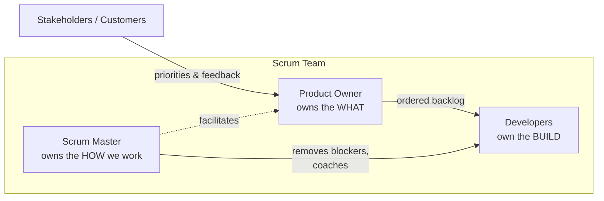
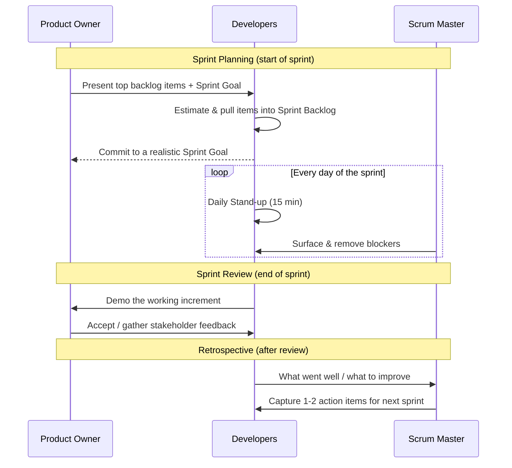
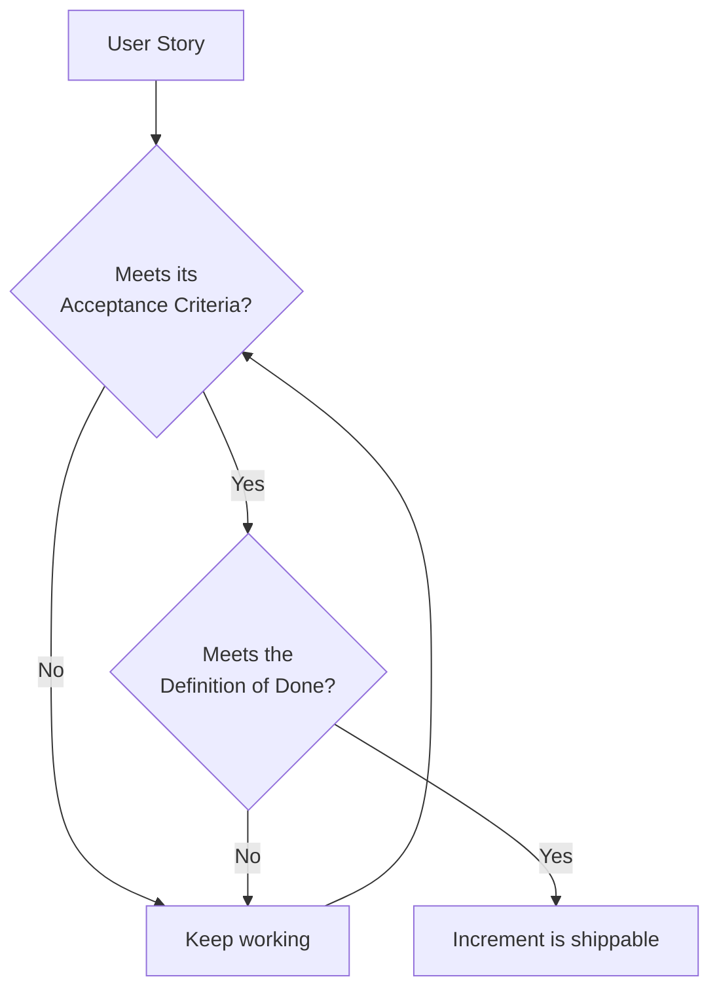

# The Scrum Framework

Scrum is the most widely used Agile framework. It organizes work into
fixed-length iterations called **sprints** and defines a small set of roles,
artifacts, and events that keep the team aligned.

## The three pillars

Scrum is built on **empiricism** — making decisions based on what is observed:

- **Transparency** — the work and progress are visible to everyone.
- **Inspection** — artifacts and progress are checked frequently.
- **Adaptation** — the team adjusts as soon as something is off.

## Roles (Accountabilities)

| Role | Responsible for | Not responsible for |
|------|-----------------|---------------------|
| **Product Owner** | Backlog priority, maximizing value, the "why" | Telling devs *how* to build |
| **Scrum Master** | Process health, removing impediments, coaching | Assigning tasks, managing people |
| **Developers** | Estimating, building, testing, the Definition of Done | Changing scope mid-sprint without agreement |

## Artifacts

| Artifact | Description | Commitment |
|----------|-------------|------------|
| **Product Backlog** | Ordered list of everything the product might need. | Product Goal |
| **Sprint Backlog** | Items selected for this sprint + a plan to deliver them. | Sprint Goal |
| **Increment** | A usable, "done" slice of product. | Definition of Done |

## The events, in sequence

## The events explained

### Sprint Planning
- **When:** First day of the sprint.
- **Output:** A Sprint Goal and a Sprint Backlog the team believes is achievable.
- **Key question:** "What can we deliver, and how?"

### Daily Stand-up (Daily Scrum)
- **When:** Same time every day, time-boxed to 15 minutes.
- **Classic format:** What did I do? What will I do? What's blocking me?
- **Better framing:** "Are we on track to meet the Sprint Goal? What needs to change?"

### Sprint Review
- **When:** End of the sprint.
- **Purpose:** Inspect the increment with stakeholders and adapt the backlog.
- **Not** a status meeting — it's a working demo.

### Retrospective
- **When:** After the review, before the next planning.
- **Purpose:** Improve the *process*, not the product.
- **Output:** A small number of concrete, owned action items.

## Definition of Done vs Acceptance Criteria

These are easy to confuse:

- **Acceptance Criteria** are *per story* — the specific conditions that make
  *this* feature correct.
- **Definition of Done** is *global* — the quality bar every story must clear
  (tested, reviewed, documented, deployed to staging, etc.).

See [Sprint-Lifecycle-Week-by-Week.md](./03-Sprint-Lifecycle-Week-by-Week.md) to
watch these events play out across two weeks.
