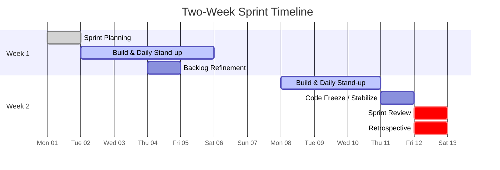
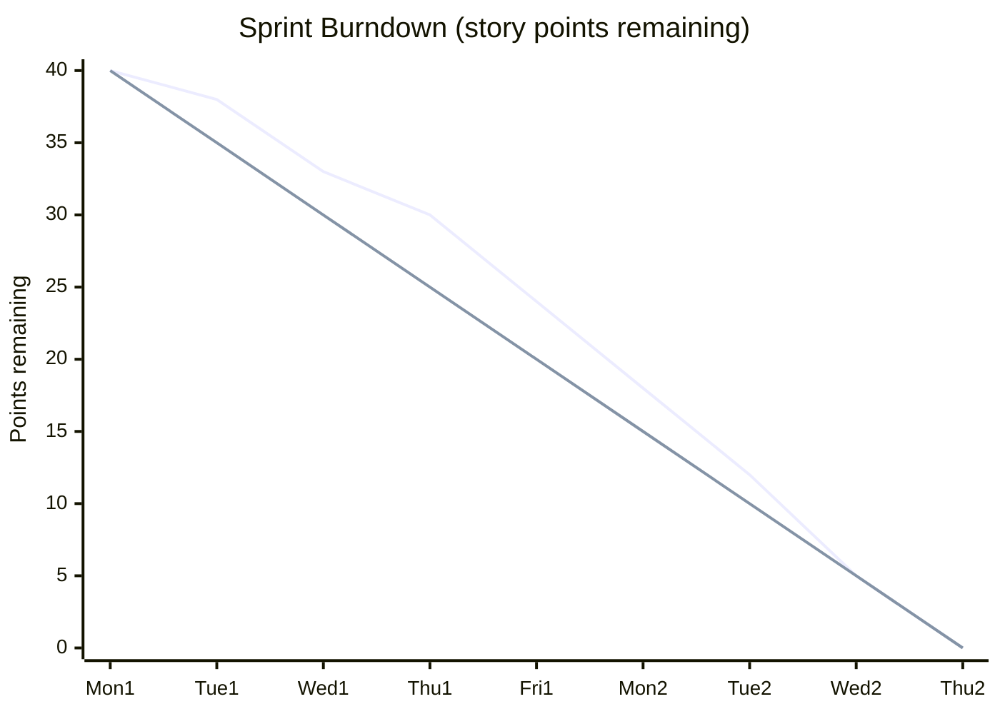
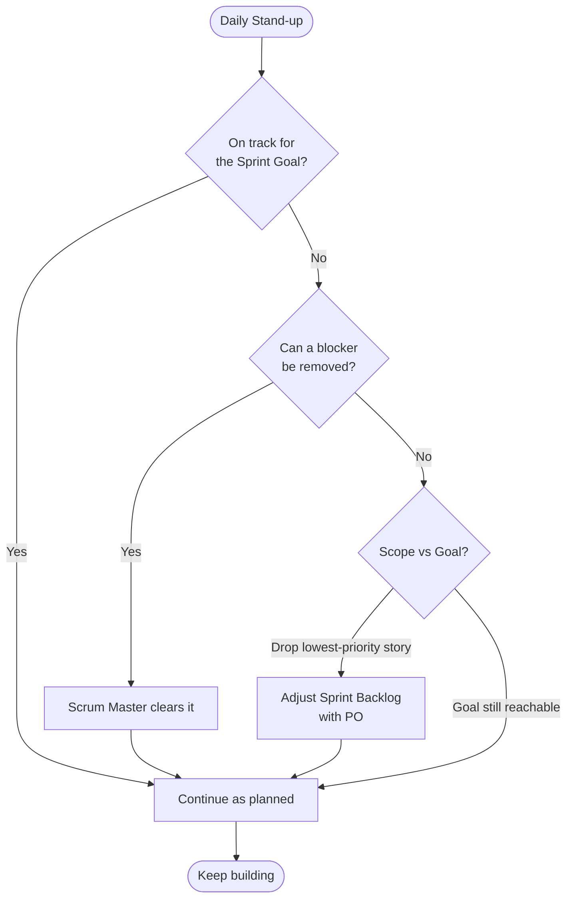

# Sprint Lifecycle: Week by Week

This walks through a typical **2-week sprint** (the most common length) so you
can see *when* each event happens and *what* the team is actually doing on each
day.

## The sprint at a glance

## Day-by-day

### Week 1

| Day | Focus | What happens |
|-----|-------|--------------|
| **Mon** | Sprint Planning | Team agrees the Sprint Goal, pulls stories into the Sprint Backlog, breaks them into tasks. |
| **Tue** | Build | First stand-up of the sprint. Developers pick up the highest-priority tasks. |
| **Wed** | Build | Stand-up. Early integration; raise blockers fast. |
| **Thu** | Build + Refinement | Mid-sprint **Backlog Refinement**: PO and team groom upcoming stories so *next* sprint's planning is smooth. |
| **Fri** | Build | Stand-up. Aim to have something demo-able starting to take shape. |

### Week 2

| Day | Focus | What happens |
|-----|-------|--------------|
| **Mon** | Build | Stand-up. Burndown check — are we on track for the Sprint Goal? |
| **Tue** | Build | Stand-up. Start wrapping up; resist adding new scope. |
| **Wed** | Stabilize | Code freeze for the increment. Final testing, bug-fixing, polish. |
| **Thu** | **Review + Retro** | Demo the increment to stakeholders. Then the team reflects and picks improvements. |
| **Fri** | Buffer / next planning prep | Slack day, deployment, or roll straight into the next sprint. |

## Tracking progress: the burndown chart

A **burndown** shows remaining work (in story points or hours) against time.
The ideal line is a straight slope to zero.

- The **first line** is actual remaining work.
- The **second line** is the ideal trajectory.
- Above the ideal line → behind schedule. Below → ahead.

## The decision flow during a sprint

## Common anti-patterns to avoid

- **Scope creep mid-sprint** — new "urgent" work shoved in without dropping anything.
- **Stand-ups that become status reports to a manager** — they're for the team.
- **Skipping the retro** — the one event that makes the team better over time.
- **A "mini-waterfall" sprint** — design all week 1, test all week 2. Slice
  vertically instead so something is *done* early.

Next: see this applied end-to-end in
[Practical-Project-Example.md](./04-Practical-Project-Example.md).
