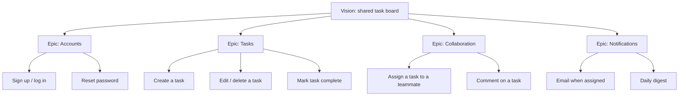
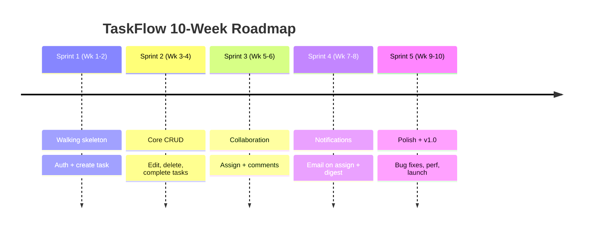
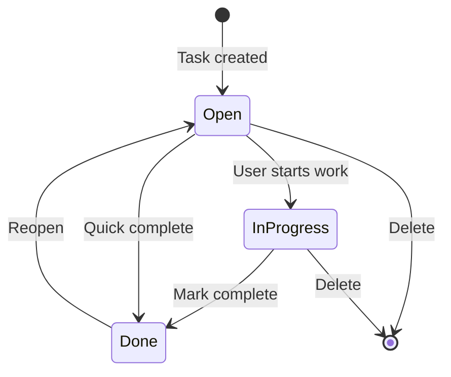
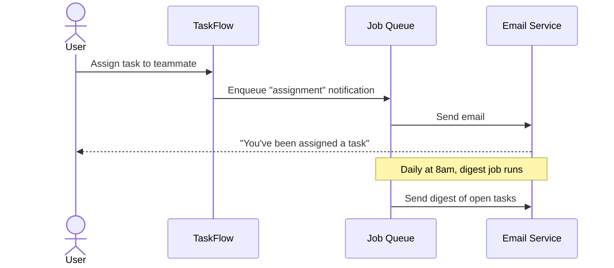
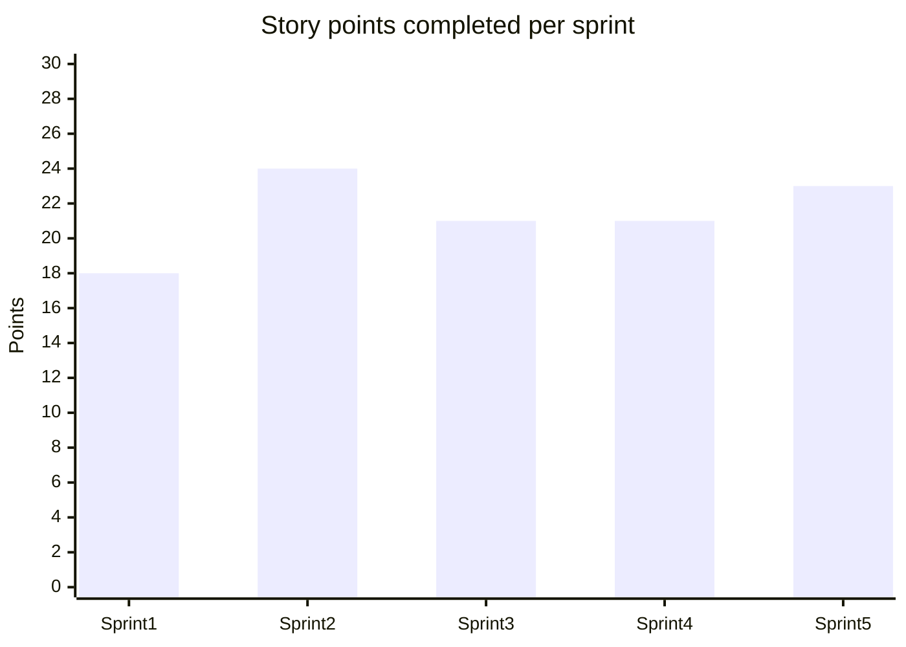

# Practical Project Example: Building "TaskFlow"

To make Agile concrete, let's follow a small team building **TaskFlow**, a
simple team to-do / task-management web app. We'll watch it grow across **five
2-week sprints** (10 weeks total).

## The team

| Person | Role |
|--------|------|
| Maya | Product Owner |
| Sam | Scrum Master |
| Priya, Leo, Dan | Developers (full-stack) |

**Sprint length:** 2 weeks · **Team velocity (after warm-up):** ~24 points/sprint

## Step 1 — The Product Vision

> *For busy teams who lose track of work, TaskFlow is a web app that keeps
> tasks, owners, and due dates in one shared board — so nothing slips through
> the cracks.*

## Step 2 — The initial Product Backlog (epics → stories)

## Step 3 — The release roadmap

---

## Sprint 1 (Weeks 1–2) — The "Walking Skeleton"

**Sprint Goal:** *A user can sign up, log in, and create a single task that
persists.*

The first sprint deliberately delivers a thin, end-to-end slice — auth + one
task — so the whole architecture is proven early rather than at the end.

| Story | Points | Outcome |
|-------|--------|---------|
| Sign up / log in | 8 | ✅ Done |
| Create a task | 5 | ✅ Done |
| Project scaffolding & CI | 5 | ✅ Done |
| Reset password | 5 | ⛔ Pulled — ran out of time |

**What week 1 looked like:** scaffolding, database schema, CI pipeline, auth API.
**What week 2 looked like:** login UI, "create task" form, wiring it together,
demo prep.

**Review:** Maya demos signing up and adding a task. Stakeholders love it but
ask that tasks show a due date — added to the backlog.

**Retro action item:** "We underestimated auth. Let's split big stories before
planning." → leads to better refinement next time.

---

## Sprint 2 (Weeks 3–4) — Core Task Management

**Sprint Goal:** *A user can fully manage their own tasks (edit, delete,
complete, set due dates).*

| Story | Points | Outcome |
|-------|--------|---------|
| Edit / delete a task | 5 | ✅ Done |
| Mark task complete | 3 | ✅ Done |
| Add due dates | 5 | ✅ Done |
| Reset password (carried over) | 5 | ✅ Done |
| Task list filtering | 8 | ⛔ Carried to Sprint 3 |

**Velocity emerging:** ~24 points completed → the team now plans around that.

---

## Sprint 3 (Weeks 5–6) — Collaboration

**Sprint Goal:** *Teammates can be assigned tasks and discuss them via comments.*

This sprint a **mid-sprint scope change** arrives: a key customer asks for
@mentions in comments. Instead of jamming it in, Maya adds it to the backlog and
the team agrees to consider it for Sprint 4 — protecting the Sprint Goal.

| Story | Points | Outcome |
|-------|--------|---------|
| Assign a task to a teammate | 5 | ✅ Done |
| Comment on a task | 8 | ✅ Done |
| Task list filtering (carried) | 8 | ✅ Done |
| @mentions in comments | 5 | 🔜 Moved to backlog |

---

## Sprint 4 (Weeks 7–8) — Notifications

**Sprint Goal:** *Users are notified by email when assigned a task, and can opt
into a daily digest.*

| Story | Points | Outcome |
|-------|--------|---------|
| Email when assigned | 8 | ✅ Done |
| Daily digest | 8 | ✅ Done |
| @mentions in comments | 5 | ✅ Done |

---

## Sprint 5 (Weeks 9–10) — Polish & v1.0 Launch

**Sprint Goal:** *Ship a stable v1.0 — fix known bugs, harden performance,
launch to production.*

| Story | Points | Outcome |
|-------|--------|---------|
| Fix top 10 bugs | 8 | ✅ Done |
| Performance: paginate task lists | 5 | ✅ Done |
| Accessibility pass | 5 | ✅ Done |
| Production deploy + monitoring | 5 | ✅ Done |

**Review:** TaskFlow v1.0 ships 🎉. See
[../Semver/Semver.md](../Semver/Semver.md) for how that `1.0.0` version number
is chosen.

**Retro across the whole release:** velocity stabilized, refinement habit paid
off, and slicing thin in Sprint 1 meant zero late-stage architecture surprises.

---

## Velocity across the release

## Lessons from TaskFlow

1. **Deliver a thin end-to-end slice first.** The walking skeleton de-risks everything.
2. **Let velocity be discovered, not decreed.** Plan Sprint *n+1* with the real average.
3. **Protect the Sprint Goal.** New requests go to the backlog, not into the current sprint.
4. **Refinement is continuous.** Grooming next sprint's stories *this* sprint keeps planning short.
5. **Retros compound.** One small improvement per sprint adds up over a release.
