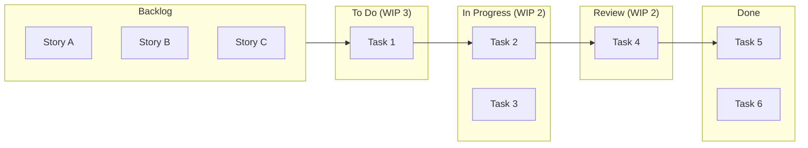
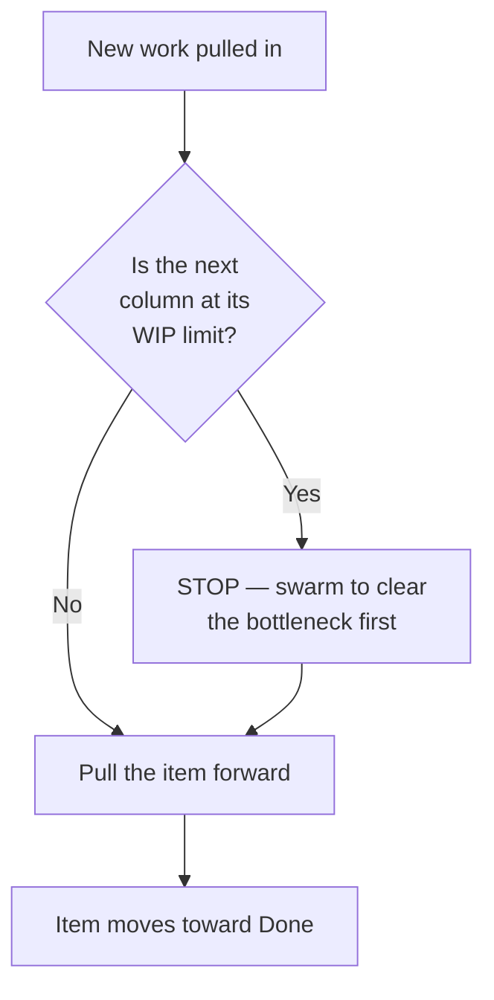
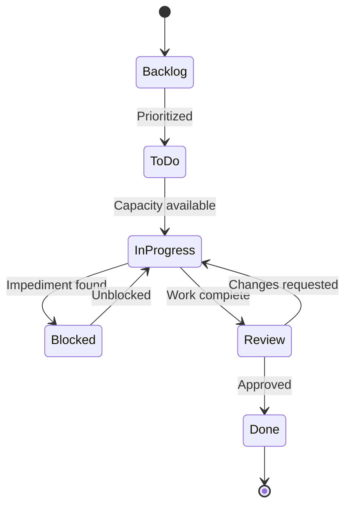
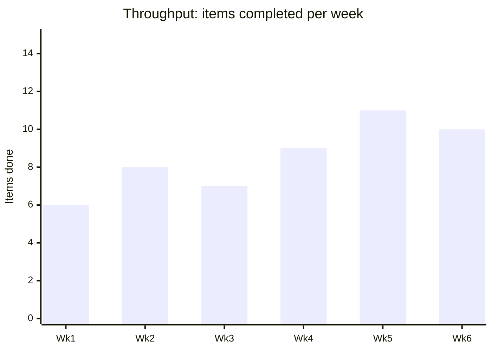
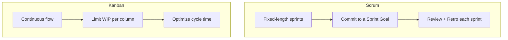

# Kanban Workflow

Kanban is a **flow-based** Agile method. Unlike Scrum, there are no fixed-length
sprints — work flows continuously, and the focus is on **limiting work in
progress (WIP)** so things actually get *finished* instead of all starting at once.

## When to choose Kanban over Scrum

| Use Kanban when… | Use Scrum when… |
|------------------|-----------------|
| Work arrives unpredictably (support, ops, maintenance) | You can plan a goal for a fixed period |
| Priorities change frequently within a day | You want a regular delivery cadence |
| You want continuous delivery | You want time-boxed commitments |
| The team is interrupt-driven | The team can protect focus for a sprint |

## A basic Kanban board

The numbers in parentheses are **WIP limits** — the maximum number of items
allowed in that column at once.

## Why WIP limits matter

When everything is "in progress," nothing is done. Limiting WIP forces the team
to **finish before they start** and exposes bottlenecks.

> **Pull, don't push.** Work is *pulled* into a column only when there's
> capacity, rather than *pushed* onto whoever is next.

## Flow as a state machine

## Key Kanban metrics

| Metric | What it measures | Why you care |
|--------|------------------|--------------|
| **Lead time** | From request to delivery | What the customer experiences |
| **Cycle time** | From "started" to "done" | Team's actual working speed |
| **Throughput** | Items finished per week | Capacity / forecasting |
| **WIP** | Items in progress now | Early warning of overload |

### Cumulative Flow — a healthy board

Bands should stay roughly parallel. A widening band means a column is becoming a
bottleneck (work entering faster than it leaves).

## Scrum vs Kanban side by side

Many teams blend the two ("**Scrumban**"): sprint cadence and retros from Scrum,
plus WIP limits and pull-based flow from Kanban.
