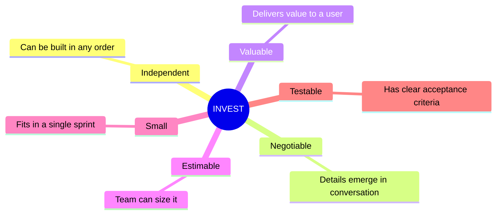
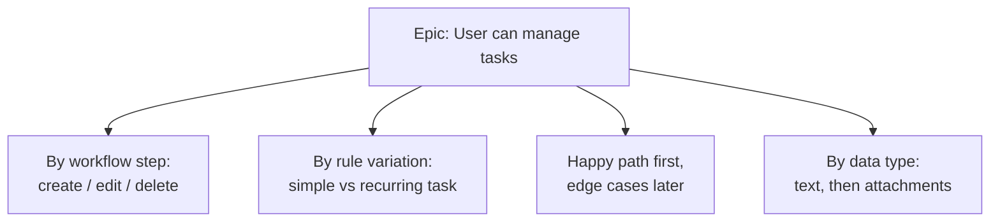
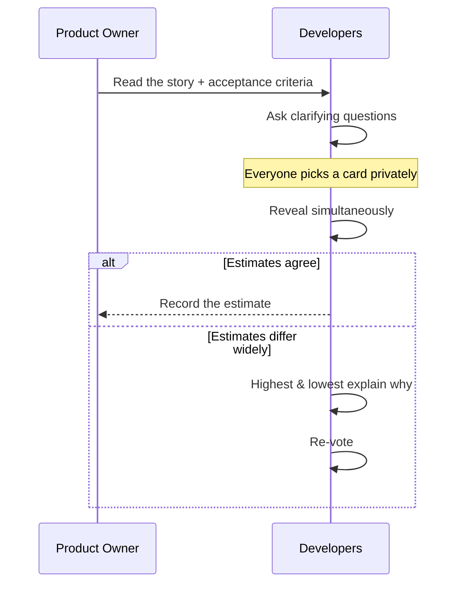
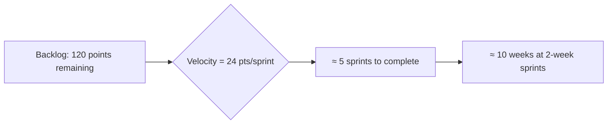

# User Stories & Estimation

The backlog is only as good as the items in it. This file covers how to write
**user stories**, slice them, define **acceptance criteria**, and estimate them
with **story points** and **planning poker**.

## Anatomy of a user story

The classic template keeps the focus on *who* and *why*, not just *what*:

> **As a** `<type of user>`, **I want** `<some goal>`, **so that** `<some reason>`.

**Example (from TaskFlow):**

> As a **team member**, I want to **be assigned a task**, so that **I know what
> I'm responsible for**.

## What makes a *good* story — INVEST



## Acceptance criteria (Given / When / Then)

Acceptance criteria turn a story into something testable. The **Gherkin** style
is common:

```gherkin
Scenario: Assigning a task notifies the assignee
  Given I am viewing an open task
  When I assign it to a teammate
  Then the teammate appears as the owner
  And the teammate receives an email notification
```

## Splitting big stories (epics)

If a story is too big to finish in a sprint, split it. Common patterns:



A useful rule: **a story should be completable in a few days, not the whole sprint.**

## Estimating with story points

Story points are a **relative** measure of effort/complexity/uncertainty — *not*
hours. Teams usually use a modified Fibonacci scale, because bigger things are
inherently more uncertain:

| Points | Meaning |
|--------|---------|
| **1** | Trivial, well understood |
| **2–3** | Small, clear |
| **5** | Medium, some unknowns |
| **8** | Large, notable complexity |
| **13** | Very large — consider splitting |
| **20+** | Too big — must split |

> Use a **reference story**: pick one everyone agrees is a "3" and estimate
> everything else relative to it.

## Planning Poker

A lightweight way to estimate as a team while surfacing hidden assumptions.



The *discussion* when estimates diverge is the real value — it reveals that
people understood the story differently.

## From points to forecast: velocity

**Velocity** = average story points completed per sprint. Once it stabilizes,
you can forecast a release.



**Caveats:**
- Velocity is a **planning tool, not a performance metric** — never compare it
  between teams or use it as a target to game.
- It takes ~3 sprints to stabilize.
- Points don't convert across teams; a "5" here isn't a "5" elsewhere.

## Quick checklist before a story enters a sprint

- [ ] Follows the "As a / I want / so that" form
- [ ] Has clear acceptance criteria
- [ ] Is small enough to finish in the sprint
- [ ] Is estimated by the whole team
- [ ] Dependencies are understood
- [ ] Meets the team's "Definition of Ready"

See [Practical-Project-Example.md](./04-Practical-Project-Example.md) to watch these
stories flow through real sprints.
