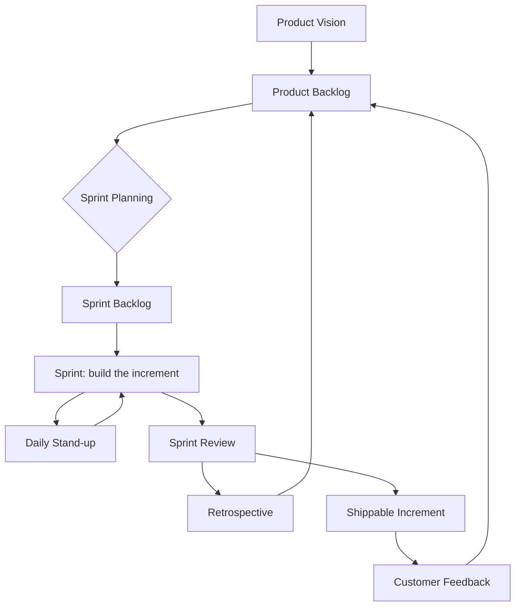

# Agile Methodology

A practical, example-driven guide to working in an Agile way — not just the
theory, but what actually happens on the ground week by week.

## Contents

| File | What it covers |
|------|----------------|
| [01-Agile-Methodology.md](./01-Agile-Methodology.md) | The fundamentals: manifesto, principles, frameworks, key terms. |
| [02-Scrum-Framework.md](./02-Scrum-Framework.md) | Roles, artifacts, and ceremonies with diagrams. |
| [03-Sprint-Lifecycle-Week-by-Week.md](./03-Sprint-Lifecycle-Week-by-Week.md) | A 2-week sprint broken down day by day. |
| [04-Practical-Project-Example.md](./04-Practical-Project-Example.md) | A full project ("TaskFlow") delivered across 5 sprints. |
| [05-Kanban-Workflow.md](./05-Kanban-Workflow.md) | Board design, WIP limits, and flow metrics. |
| [06-User-Stories-and-Estimation.md](./06-User-Stories-and-Estimation.md) | Writing stories, planning poker, velocity. |

## How it all fits together

## Reading order

1. Start with **01-Agile-Methodology.md** for the vocabulary.
2. Read **02-Scrum-Framework.md** to understand the moving parts.
3. Follow **03-Sprint-Lifecycle-Week-by-Week.md** and **04-Practical-Project-Example.md**
   to see it in motion.
4. Use **05-Kanban-Workflow.md** and **06-User-Stories-and-Estimation.md** as references.

> Diagrams use [Mermaid](https://mermaid.js.org/), which renders natively on
> GitHub and in most Markdown viewers.
