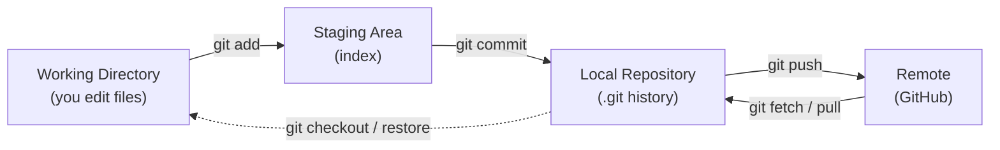
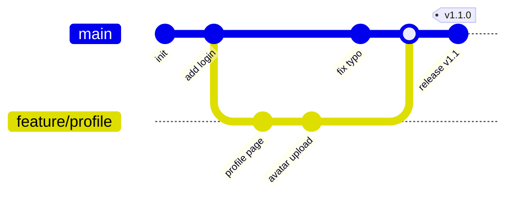
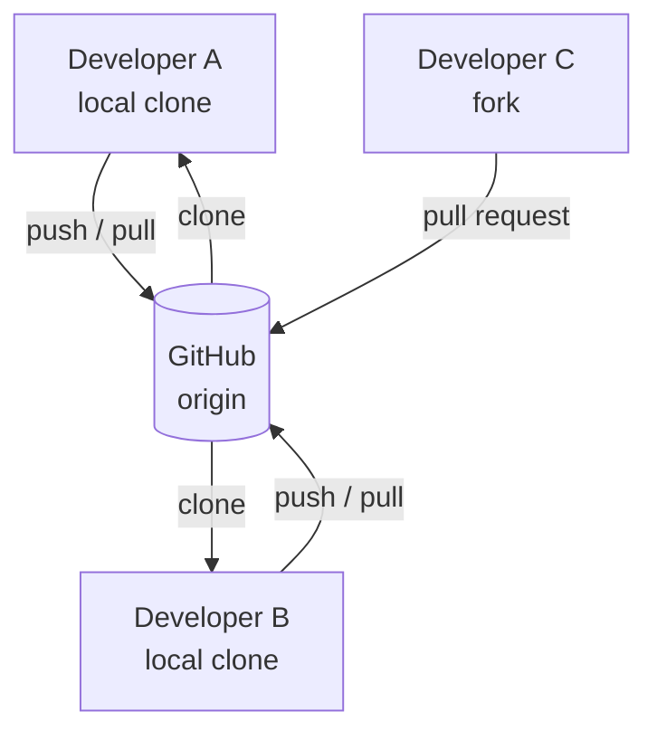

# Git and GitHub — Fundamentals

## What is Git?

**Git** is a free, open-source **distributed version control system (VCS)**.
It tracks changes to files over time, lets multiple people work on the same
project, and allows you to revert to previous states. Every developer has a full
copy of the repository, including its complete history — so you can commit,
branch, and view history even with no network connection.

## What is GitHub?

**GitHub** is a cloud-based hosting platform for Git repositories. It adds
collaboration features on top of Git, such as:

- Remote repository hosting.
- Pull Requests (code review and discussion).
- Issues and project boards.
- CI/CD via GitHub Actions.
- Access control and team management.

> **Git** is the tool; **GitHub** is a *service* that hosts Git repositories.
> Alternatives include [GitLab](./07-GitLab-Alternative.md) and Bitbucket.

## Core Concepts

| Term | Meaning |
|------|---------|
| Repository (repo) | A project tracked by Git. |
| Commit | A snapshot of changes with a message and a unique hash. |
| Branch | An independent, movable pointer to a line of development. |
| HEAD | A pointer to the commit/branch you currently have checked out. |
| Remote | A version of the repo hosted elsewhere (e.g. GitHub), usually `origin`. |
| Clone | A local copy of a remote repository. |
| Fork | A personal copy of someone else's repository on GitHub. |
| Pull Request (PR) | A request to merge changes, with review. (GitLab calls it a *Merge Request*.) |
| Merge | Combining changes from one branch into another. |
| Tag | A named pointer to a specific commit, used for releases (see [Semver](../Semver/Semver.md)). |

## The Three-Stage Workflow

Git moves your changes through three areas before they reach the remote:

| Area | What lives here | Move in with | Move out with |
|------|-----------------|--------------|---------------|
| Working Directory | Your actual files on disk | (editing) | `git restore` |
| Staging Area | Changes selected for the next commit | `git add` | `git restore --staged` |
| Local Repository | Committed snapshots + full history | `git commit` | — |
| Remote | The shared, hosted copy | `git push` | `git fetch` / `git pull` |

## A Commit is a Snapshot, Not a Diff

Each commit records the full state of the tree (via content hashes) and points
to its parent(s). Branches and `HEAD` are just lightweight pointers to commits:

## How the Pieces Relate

Because every clone is complete, there is no single point of failure: any clone
can restore the project. GitHub simply provides an agreed-upon central place to
share work.

## Next Steps

- Learn the day-to-day commands → [02-Common-Git-Operations.md](./02-Common-Git-Operations.md)
- Organize work into branches → [03-Branching-and-Environments.md](./03-Branching-and-Environments.md)

## Further Reading

- [Pro Git Book (free)](https://git-scm.com/book)
- [GitHub Docs](https://docs.github.com/)
