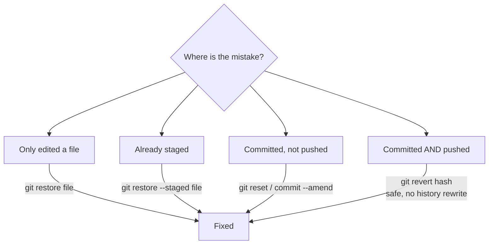
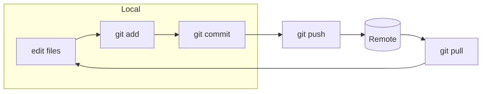

# Common Git Operations

The commands you reach for every day, grouped by task, with practical examples
and notes on what they actually do.

## Setup (once per machine)

```bash
git config --global user.name "Your Name"
git config --global user.email "you@example.com"
git config --global init.defaultBranch main   # name new repos' first branch "main"
git config --global pull.rebase false          # merge on pull (default) — see below
```

## Starting a Repository

```bash
git init                  # turn the current folder into a new repo
git clone <url>           # copy a remote repo (and its full history) locally
git clone <url> myapp     # clone into a folder named "myapp"
```

## Daily Work

```bash
git status                # see what changed and what is staged
git diff                  # unstaged changes (working dir vs staging)
git diff --staged         # staged changes (staging vs last commit)
git add <file>            # stage a specific file
git add .                 # stage everything in the current directory
git commit -m "message"   # save a snapshot of the staging area
git commit -am "message"  # stage tracked files AND commit in one step
git log                   # full history
git log --oneline --graph --all   # compact, visual history of all branches
```

### A realistic edit-and-commit cycle

```bash
# 1. See where you stand
git status

# 2. Edit files... then stage just the ones for this logical change
git add src/auth/login.js src/auth/login.test.js

# 3. Commit with a clear message
git commit -m "Add rate limiting to login endpoint"

# 4. Keep going, or push when ready
git push
```

## Branching

```bash
git branch                # list local branches (* marks current)
git branch <name>         # create a branch (does not switch to it)
git switch <name>         # switch to an existing branch (modern)
git switch -c <name>      # create AND switch (modern, preferred)
git checkout <name>       # older equivalent of switch
git checkout -b <name>    # older equivalent of switch -c
git branch -d <name>      # delete a merged branch
git branch -D <name>      # force-delete an unmerged branch
```

## Working with Remotes

```bash
git remote -v                       # list configured remotes
git remote add origin <url>         # link a local repo to a remote
git push -u origin <branch>         # push and set upstream (first push)
git push                            # push current branch to its upstream
git fetch                           # download remote changes, don't merge
git pull                            # fetch + merge (or rebase) into current branch
```

> **`fetch` vs `pull`:** `fetch` only downloads — your working files are
> untouched, so it's always safe. `pull` is `fetch` followed by an automatic
> merge (or rebase) into your current branch.

## Undoing Things

This is where Git feels scary, so here is a map of "I made a mistake at stage X":

| Situation | Command | Notes |
|-----------|---------|-------|
| Discard edits to a file (not yet staged) | `git restore <file>` | Irreversible — the edits are gone. |
| Unstage a file (keep edits) | `git restore --staged <file>` | Moves it back to working dir. |
| Fix the **last** commit message | `git commit --amend` | Rewrites history — only before pushing. |
| Add a forgotten file to the last commit | `git add <file> && git commit --amend --no-edit` | Same caveat. |
| Undo a commit, keep the changes staged | `git reset --soft HEAD~1` | History rewrite, local only. |
| Undo a commit, keep changes unstaged | `git reset HEAD~1` | Default (`--mixed`). |
| Undo a commit, **discard** the changes | `git reset --hard HEAD~1` | Destructive — changes are lost. |
| Undo a *pushed* commit safely | `git revert <hash>` | Creates a new commit that reverses it. |



> **Golden rule:** rewrite history (`reset`, `--amend`, `rebase`) only on commits
> you have **not** shared. For anything already pushed, use `git revert`.

## Stashing (park work without committing)

```bash
git stash               # shelve uncommitted changes, clean the working dir
git stash list          # see stashed entries
git stash pop           # reapply the latest stash and remove it
git stash apply         # reapply but keep it in the stash list
```

Useful when you need to switch branches in a hurry but aren't ready to commit.

## Inspecting History

```bash
git log --oneline                  # one line per commit
git log -p <file>                  # show diffs that touched a file
git show <hash>                    # full details of one commit
git blame <file>                   # who last changed each line, and when
git diff main..feature/login       # what differs between two branches
```

## Tagging Releases

```bash
git tag v1.2.0                     # lightweight tag on current commit
git tag -a v1.2.0 -m "Release 1.2.0"   # annotated tag (preferred for releases)
git push origin v1.2.0            # tags are NOT pushed by git push alone
git push origin --tags            # push all tags
```

See [Semver](../Semver/Semver.md) for how to choose version numbers.

## Quick Reference



## Further Reading

- [Pro Git Book (free)](https://git-scm.com/book)
- [git-scm reference](https://git-scm.com/docs)
