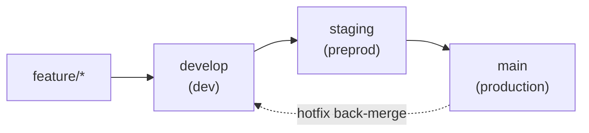
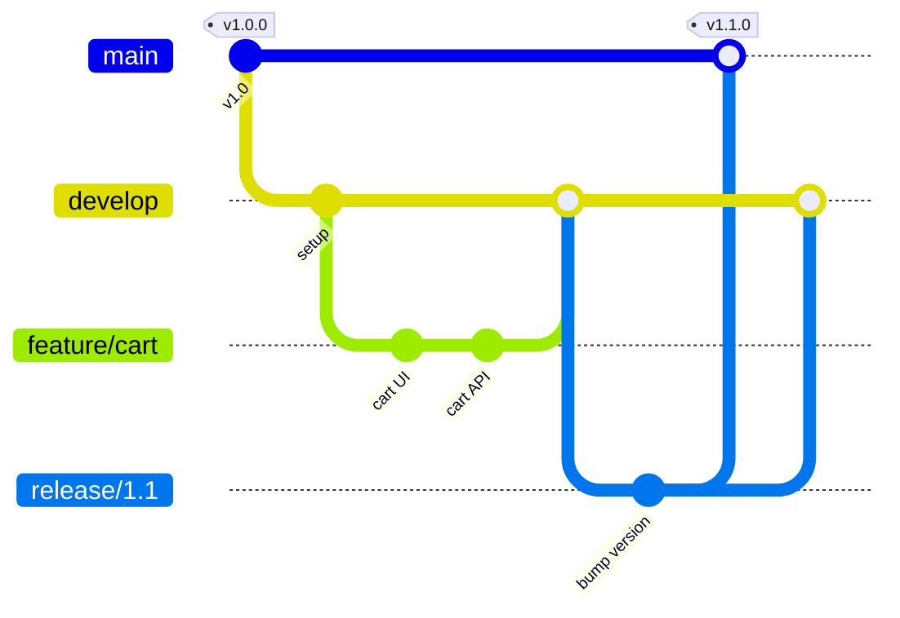
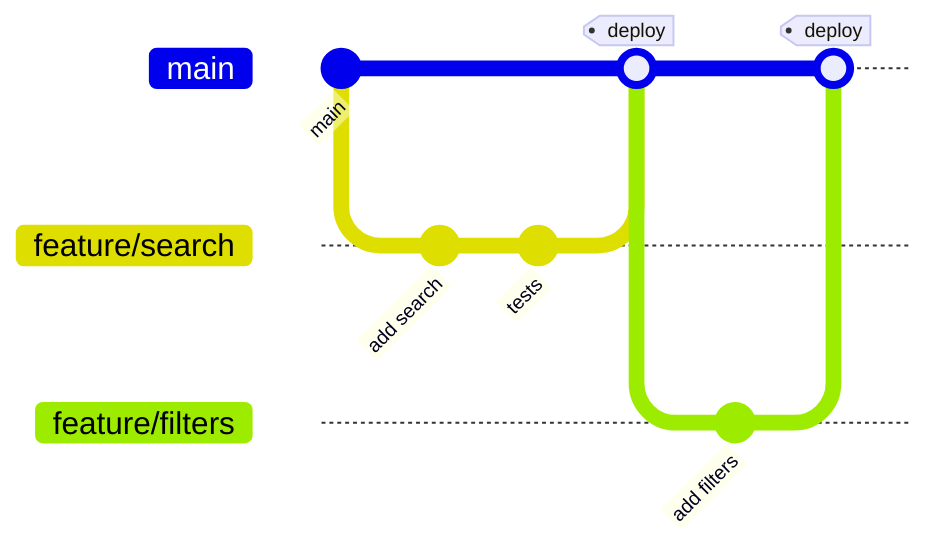
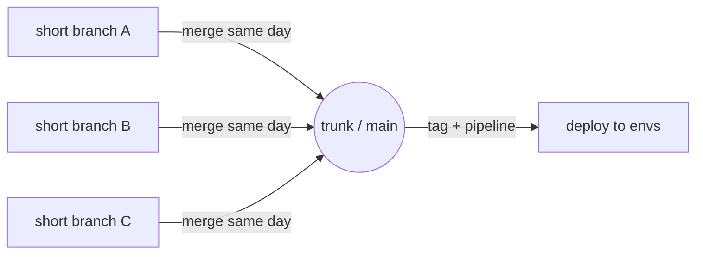
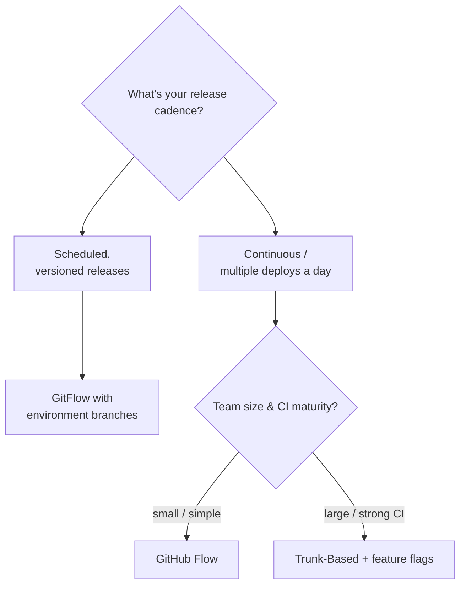

# Branching Strategies & Environment Branches

Branches let work happen in parallel without stepping on each other. How you
organize them — and how they map to deployment environments — is your team's
**branching strategy**.

## Branch Types

| Branch type | Example | Purpose |
|-------------|---------|---------|
| Production / trunk | `main`, `master`, `prod` | Live, customer-facing code. |
| Integration | `develop`, `dev` | Where ongoing work is combined. |
| Feature | `feature/login-rate-limit` | One feature or task. |
| Release | `release/1.4.0` | Stabilizing a version for release. |
| Hotfix | `hotfix/payment-crash` | Urgent production fix, branched from `main`. |

> **Naming tip:** use a prefix + short kebab-case description, e.g.
> `feature/`, `bugfix/`, `hotfix/`, `release/`. Many teams append a ticket id:
> `feature/PROJ-123-login-rate-limit`.

## What are Environment Branches?

**Environment branches** are long-lived branches that each map to a specific
deployment environment. Code in a branch reflects what is (or will be) running in
that environment. This makes it easy to control what gets deployed where and to
promote code through stages with confidence.

### Typical Environments

| Environment | Branch (example) | Purpose |
|-------------|------------------|---------|
| Development | `develop` / `dev` | Integration of ongoing work. |
| Testing / QA | `test` / `qa` | Quality assurance and validation. |
| Staging | `staging` / `preprod` | Production-like rehearsal. |
| Production | `main` / `master` / `prod` | Live, customer-facing code. |

### The Promotion Flow

Code flows in one direction, from less stable to more stable:

1. Developers branch off `develop` to build features (`feature/*`).
2. Completed features merge back into `develop`.
3. `develop` is promoted to `staging` for pre-production testing.
4. After validation, `staging` is promoted to `main` and deployed to production.

### Why use environment branches?

- **Clear separation** of what runs in each environment.
- **Controlled releases** — promote only validated code.
- **Easier rollbacks** — each environment has a known good state.
- **Automated deployments** — CI/CD can deploy on push to a branch.

## Strategy 1: GitFlow

A structured model with two long-lived branches (`main` + `develop`) and
supporting short-lived branches. Good for **scheduled releases** and products
that ship versioned releases.

**Pros:** clear separation, parallel release work, well-suited to versioned
products. **Cons:** heavyweight, lots of long-lived branches, more merging.

## Strategy 2: GitHub Flow

One long-lived branch (`main`) plus short-lived feature branches. Every change
goes through a Pull Request; `main` is always deployable. Good for **continuous
delivery** of web apps.

**Pros:** simple, fast, ideal for CD. **Cons:** less ceremony around releases;
relies heavily on good CI and feature flags.

## Strategy 3: Trunk-Based Development

A single `main` (trunk) with very short-lived branches (hours to a day) merged
frequently. Unfinished work is hidden behind **feature flags** rather than
long-lived branches. Environments are driven by tags or pipelines, not branches.

**Pros:** minimal merge pain, fast integration, scales to large teams. **Cons:**
requires strong CI, feature flags, and discipline.

## Which Strategy Should You Pick?

| Strategy | Best for | Long-lived branches |
|----------|----------|---------------------|
| GitFlow | Versioned products, scheduled releases | `main`, `develop` |
| GitHub Flow | Web apps with continuous delivery | `main` |
| Trunk-Based | Large teams, high-frequency deploys | `main` only |

## Best Practices

- Keep production branches **protected** (require PRs and reviews — see
  [06-GitHub-Features.md](./06-GitHub-Features.md)).
- **Never commit directly to `main`** — always promote through PRs.
- Keep feature branches **short-lived** to minimize painful merges.
- Use CI/CD to automate environment deployments.
- **Tag releases** (see [Semver](../Semver/Semver.md)).
- Use hotfix branches for urgent production fixes, then **back-merge** into
  `develop` so the fix isn't lost in the next release.

## Further Reading

- [A successful Git branching model (GitFlow)](https://nvie.com/posts/a-successful-git-branching-model/)
- [GitHub Flow](https://docs.github.com/en/get-started/using-github/github-flow)
- [Trunk Based Development](https://trunkbaseddevelopment.com/)
