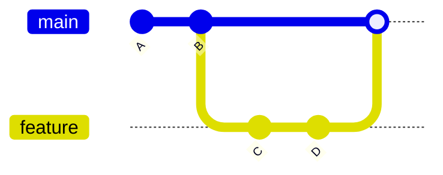
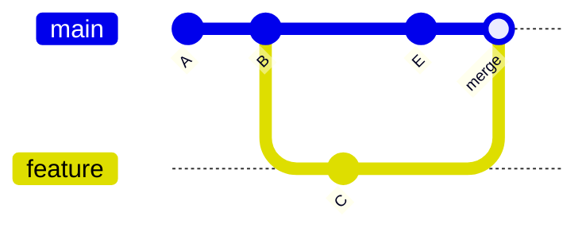
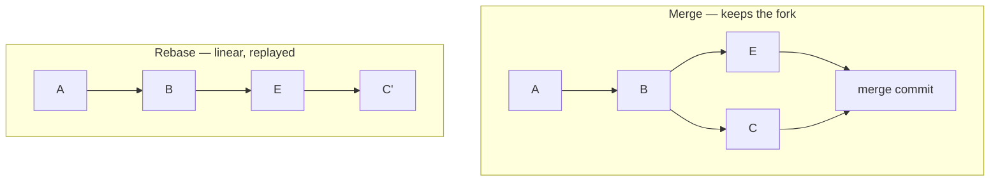
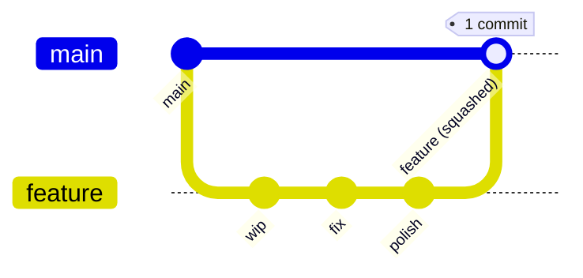
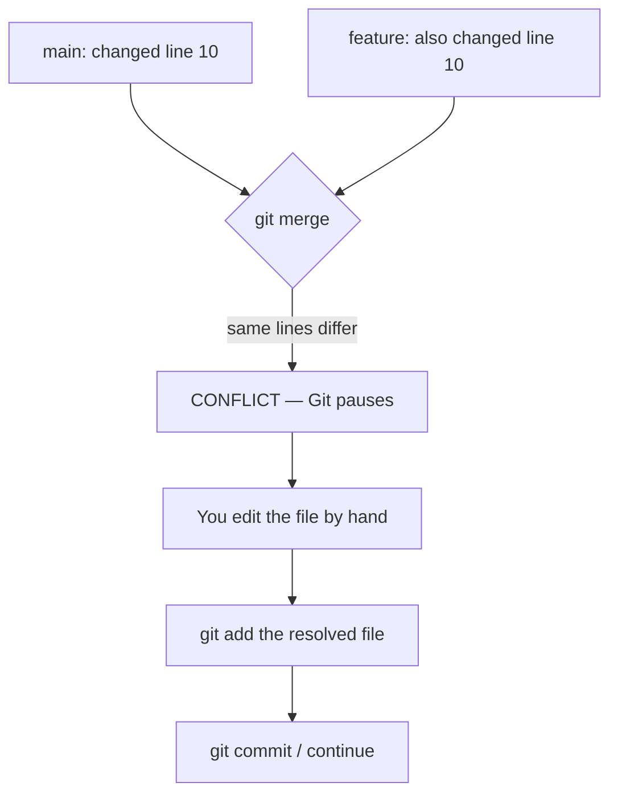

# Merging & Conflict Resolution

Integrating one branch's work into another is the heart of collaboration. This
page covers how merges work, the difference between merge and rebase, and how to
resolve conflicts calmly.

## Fast-Forward Merge

If the target branch hasn't moved since you branched off, Git can just slide its
pointer forward — no new commit needed.



```bash
git switch main
git merge feature        # fast-forward: main now points at D
```

## Three-Way (True) Merge

If `main` advanced while you worked, Git creates a **merge commit** with two
parents, combining both histories.



```bash
git switch main
git merge feature        # creates a merge commit tying both lines together
```

## Merge vs Rebase

Both integrate changes, but they shape history differently.

| | `git merge feature` | `git rebase main` (from feature) |
|---|---|---|
| History | Preserves real history, adds a merge commit | Replays your commits on top of `main` — linear history |
| Result | Branching graph | Straight line |
| Safety | Safe on shared branches | **Rewrites commits** — never rebase shared/pushed branches |
| Use when | Merging a PR into `main` | Tidying your *local* branch before opening a PR |



```bash
# Tidy your feature branch on top of the latest main BEFORE opening the PR
git switch feature
git fetch origin
git rebase origin/main
# ...resolve any conflicts, then:
git push --force-with-lease     # safe force-push for a rebased local branch
```

> **`--force-with-lease`** refuses to overwrite the remote if someone else pushed
> in the meantime — much safer than `--force`.

## Squash Merge

Combines all the commits of a feature branch into a **single** commit on `main`.
Popular on GitHub/GitLab for keeping `main` history clean and readable.



| Merge style | History on main | Good for |
|-------------|-----------------|----------|
| Merge commit | Full branch history + a merge node | Auditing, preserving context |
| Squash | One clean commit per feature | Tidy linear history |
| Rebase & merge | Each commit replayed, no merge node | Linear history, commit granularity kept |

## What is a Merge Conflict?

A conflict happens when **two branches change the same lines** of the same file
(or one edits a file the other deletes). Git can't decide which to keep, so it
asks you.



### What a conflict looks like in the file

```text
<<<<<<< HEAD
const timeout = 30;        // your current branch's version
=======
const timeout = 60;        // the incoming branch's version
>>>>>>> feature/login
```

You edit the file to the version you want, **removing the `<<<`, `===`, `>>>`
markers**, then stage and continue.

### Resolving step by step

```bash
git merge feature
# CONFLICT (content): Merge conflict in src/config.js

git status                 # lists "Unmerged paths"

# 1. Open each conflicted file, pick/blend the correct content,
#    and delete the conflict markers.

# 2. Mark each file as resolved
git add src/config.js

# 3. Finish the merge
git commit                 # (message is pre-filled for a merge)

# To bail out entirely and return to before the merge:
git merge --abort
```

For a rebase, the equivalents are `git rebase --continue` and
`git rebase --abort`.

### Helpful tools

```bash
git config --global merge.conflictstyle zdiff3   # clearer markers (shows base)
git mergetool                                     # open a visual merge tool
```

VS Code, JetBrains IDEs, and GitHub's web editor all provide a side-by-side
"Accept Current / Incoming / Both" UI that makes this much easier.

## Best Practices to Avoid Painful Merges

- **Pull/rebase often** — integrate `main` into your branch daily so conflicts
  stay small.
- **Keep branches short-lived and focused** — the longer a branch lives, the
  more it drifts.
- **Make small, logical commits** — easier to reason about during a conflict.
- **Communicate** — if two people must touch the same file, coordinate.
- **Run tests after resolving** — a clean merge can still be logically wrong.

## Further Reading

- [Git Branching — Basic Merging](https://git-scm.com/book/en/v2/Git-Branching-Basic-Branching-and-Merging)
- [Git Tools — Rewriting History](https://git-scm.com/book/en/v2/Git-Tools-Rewriting-History)
