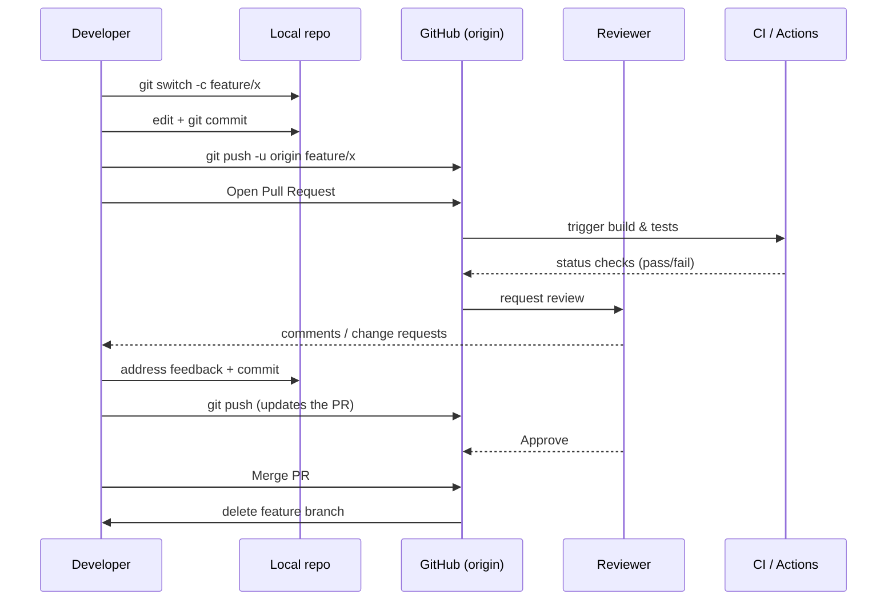
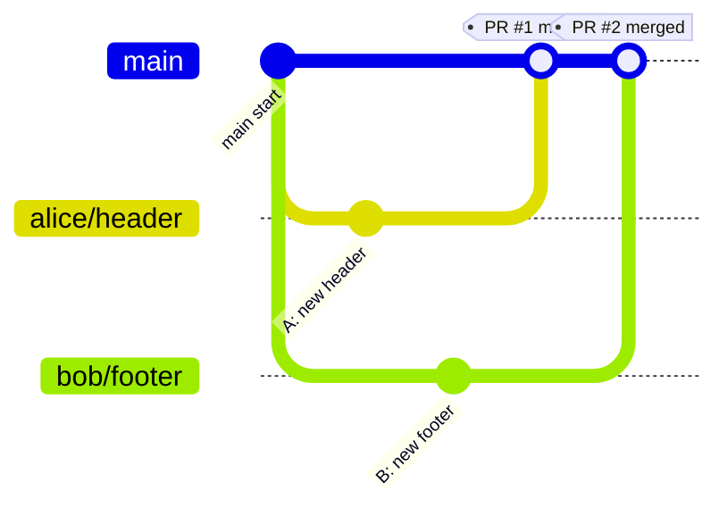
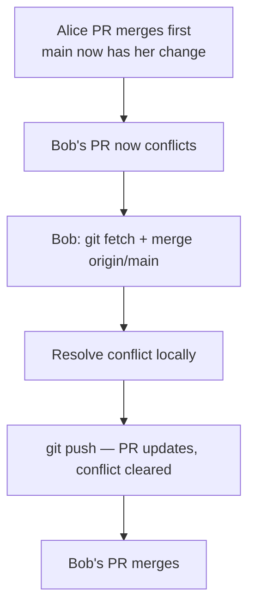
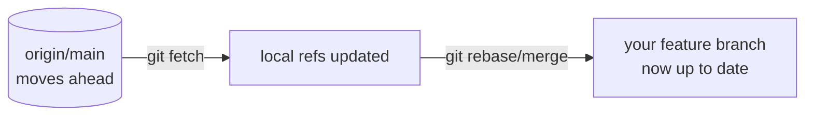
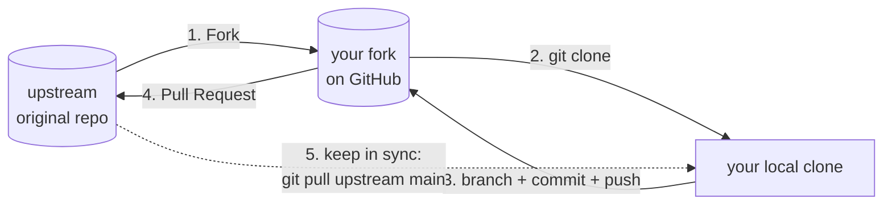

# Team Collaboration Workflows

What actually happens when several developers work on the same repository — the
Pull Request lifecycle, two people touching the same code, and how the open-source
fork model works.

## The Pull Request Lifecycle



### Step by step

1. **Create a feature branch** off the latest `main`.
2. **Commit** small, logical changes and **push** the branch.
3. **Open a Pull Request** describing *what* and *why*.
4. **CI runs** automatically — tests, linting, [SonarQube](../SonarQube/SonarQube.md) quality gate.
5. **Teammates review** and leave comments.
6. **Address feedback** with new commits (the PR updates automatically).
7. **Merge** once approved and checks are green.
8. **Delete** the feature branch.

## Scenario: Two Developers, One Repo

Alice and Bob both start from the same commit on `main`.



### Different files → clean integration

If Alice edits `header.js` and Bob edits `footer.js`, both PRs merge cleanly.
The only catch: whoever merges **second** should pull `main` first.

```bash
# Bob, before merging, syncs with the now-updated main
git switch bob/footer
git fetch origin
git merge origin/main        # or: git rebase origin/main
git push
```

### Same file → conflict

If both edit `styles.css` on the same lines, the **second** PR to merge hits a
conflict. The flow:



```bash
# Bob resolves the conflict on his branch, not on main
git switch bob/footer
git fetch origin
git merge origin/main
# ...fix styles.css, remove conflict markers...
git add styles.css
git commit
git push                      # the PR is now mergeable
```

See [04-Merging-and-Conflict-Resolution.md](./04-Merging-and-Conflict-Resolution.md)
for the mechanics of resolving conflicts.

## Keeping Your Branch in Sync

A daily habit that keeps merges tiny:

```bash
git switch feature/mine
git fetch origin
git rebase origin/main        # replay your work on the latest main
# (or)  git merge origin/main  # if your team prefers merge commits
```



## The Fork & Pull Model (Open Source)

When you don't have write access to a repo (e.g. contributing to open source),
you work from a **fork**.



```bash
# After forking on GitHub and cloning your fork:
git remote add upstream <original-repo-url>   # track the original
git fetch upstream
git switch -c fix/typo upstream/main          # branch off the latest upstream
# ...commit, push to YOUR fork, then open a PR against upstream...
git push origin fix/typo
```

## Roles in a Typical Team Flow

| Role | Does |
|------|------|
| Author | Creates the branch, opens the PR, addresses feedback. |
| Reviewer | Reads the diff, runs it if needed, requests changes or approves. |
| Maintainer | Owns merge rights, enforces branch protection, manages releases. |
| CI/CD | Automatically builds, tests, and reports status on every push. |

## Best Practices

- **One PR = one logical change.** Small PRs get reviewed faster and merge cleaner.
- **Write a clear PR description**: what changed, why, how to test.
- **Pull before you push** to avoid surprise conflicts.
- **Resolve conflicts on your branch**, never directly on `main`.
- **Don't let branches go stale** — rebase/merge `main` in regularly.
- **Require green CI and at least one approval** before merging (enforced via
  branch protection — see [06-GitHub-Features.md](./06-GitHub-Features.md)).

## Further Reading

- [GitHub: About pull requests](https://docs.github.com/en/pull-requests)
- [GitHub: Contributing to a project (fork & PR)](https://docs.github.com/en/get-started/exploring-projects-on-github/contributing-to-a-project)
