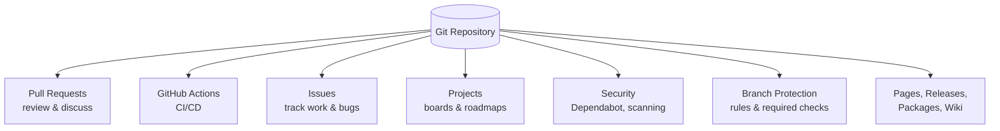
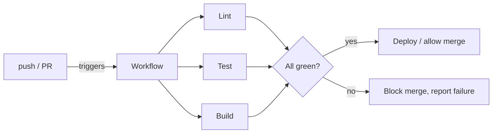
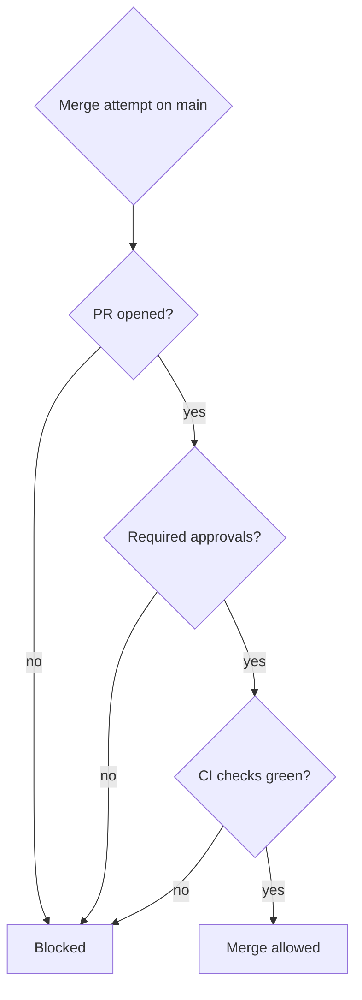
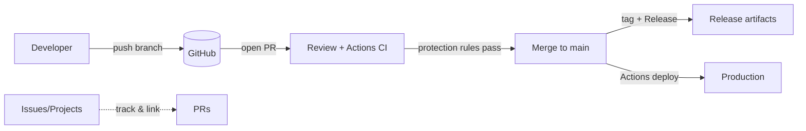

# What GitHub Offers (Beyond Plain Git)

Git is the version-control engine. GitHub wraps it with collaboration, automation,
and project-management features. Here's what you get on top of `git`.

## Overview



## Pull Requests

The core collaboration unit: propose changes from a branch, discuss them inline,
and merge when approved.

- **Inline code review** — comment on specific lines; start review threads.
- **Required reviewers / CODEOWNERS** — auto-request the right people.
- **Status checks** — block merge until CI passes.
- **Merge options** — merge commit, squash, or rebase-and-merge.
- **Draft PRs** — share work-in-progress without requesting review yet.
- **Suggested changes** — reviewers propose exact edits the author can accept in one click.

## GitHub Actions (CI/CD)

Automation triggered by repository events (push, PR, schedule, release). Defined
in YAML under `.github/workflows/`.

```yaml
# .github/workflows/ci.yml
name: CI
on: [push, pull_request]
jobs:
  test:
    runs-on: ubuntu-latest
    steps:
      - uses: actions/checkout@v4
      - uses: actions/setup-node@v4
        with: { node-version: 20 }
      - run: npm ci
      - run: npm test
```



## Issues & Projects

- **Issues** — track bugs, features, and tasks; label, assign, and reference them
  from commits/PRs (e.g. `Fixes #42` auto-closes the issue on merge).
- **Projects** — flexible boards (Kanban, table, roadmap) that pull in issues and
  PRs. Pairs naturally with [Agile workflows](../Agile-Methodology/README.md).
- **Milestones** — group issues/PRs toward a release.

## Branch Protection Rules

Guardrails on important branches like `main`:

| Rule | Effect |
|------|--------|
| Require a pull request before merging | No direct pushes to `main`. |
| Require approvals | e.g. at least 1–2 reviewer approvals. |
| Require status checks to pass | CI must be green before merge. |
| Require branches up to date | Force a rebase/merge of latest `main` first. |
| Require signed commits | Verify commit authorship (GPG/SSH). |
| Restrict who can push | Only maintainers/teams. |



## Security Features

- **Dependabot** — alerts and automatic PRs for vulnerable/outdated dependencies.
- **Code scanning (CodeQL)** — static analysis for security bugs on each PR.
- **Secret scanning** — detects committed credentials and tokens.
- **Security advisories** — privately coordinate and disclose fixes.

## Other Notable Features

| Feature | What it's for |
|---------|---------------|
| Releases | Publish tagged versions with notes and binaries (see [Semver](../Semver/Semver.md)). |
| Packages | Host npm, Maven, Docker, NuGet, etc. registries. |
| Pages | Free static-site hosting from a repo. |
| Wiki | Project documentation alongside the code. |
| Discussions | Q&A and community conversation, separate from Issues. |
| Codespaces | Cloud dev environments in the browser. |
| Copilot | AI code completion and chat. |
| Organizations & Teams | Group repos, manage members and permissions at scale. |

## How It Comes Together



## Further Reading

- [GitHub Docs](https://docs.github.com/)
- [GitHub Actions](https://docs.github.com/en/actions)
- [About protected branches](https://docs.github.com/en/repositories/configuring-branches-and-merges-in-your-repository/managing-protected-branches)
