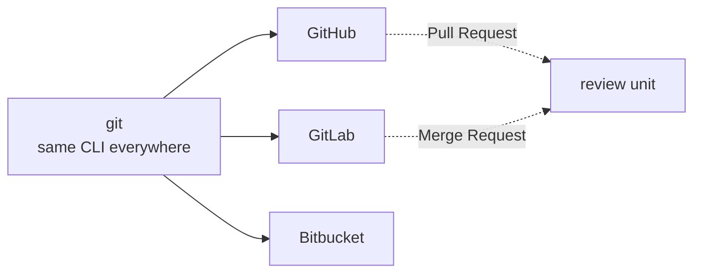
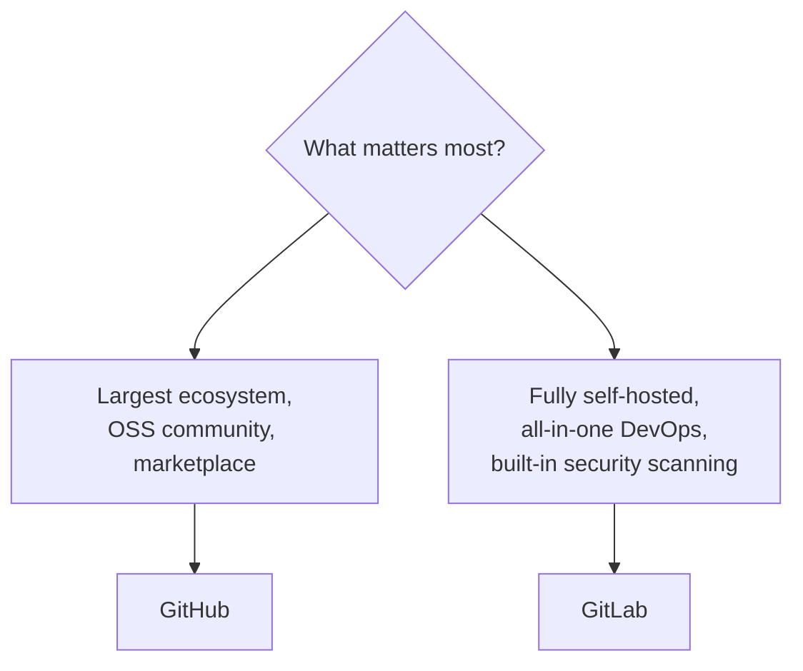

# GitLab — An Alternative to GitHub

GitLab is the most common alternative to GitHub. Both host Git repositories and
add collaboration on top, but GitLab positions itself as a single, integrated
**DevOps platform** (plan → code → build → test → deploy → monitor). Crucially,
the underlying `git` commands are **identical** — only the platform features and
terminology differ.

## Same Git, Different Platform



Your day-to-day commands (`clone`, `add`, `commit`, `push`, `pull`, `merge`,
`rebase`) don't change. You just push to a GitLab remote instead of a GitHub one.

## Terminology Map

| Concept | GitHub | GitLab |
|---------|--------|--------|
| Propose & review changes | Pull Request (PR) | **Merge Request (MR)** |
| CI/CD config | `.github/workflows/*.yml` (Actions) | `.gitlab-ci.yml` (GitLab CI/CD) |
| Automation runners | GitHub-hosted / self-hosted runners | GitLab Runners |
| Issue boards | Projects | Issue Boards / Epics |
| Package hosting | GitHub Packages | GitLab Package Registry |
| Static site hosting | GitHub Pages | GitLab Pages |
| Org grouping | Organizations / Teams | **Groups / Subgroups** |
| AI assistant | Copilot | GitLab Duo |

## Feature Comparison

| Area | GitHub | GitLab |
|------|--------|--------|
| Hosting model | Cloud (github.com) + GitHub Enterprise Server | Cloud (gitlab.com) + **strong self-hosted** (Community/Enterprise Edition) |
| CI/CD | GitHub Actions (huge marketplace) | Built-in GitLab CI/CD (mature, first-class) |
| Open source | Largest OSS community & ecosystem | Core is open-source; self-host the whole platform free |
| DevOps scope | Best-of-breed, integrates many tools | Single integrated platform (plan→monitor) |
| Built-in security | Dependabot, CodeQL, secret scanning | SAST/DAST, dependency & container scanning built in |
| Self-managed | Enterprise Server (paid) | CE is free to self-host |

## GitLab CI/CD Example

The same idea as GitHub Actions, expressed in `.gitlab-ci.yml` at the repo root:

```yaml
# .gitlab-ci.yml
stages: [test, build, deploy]

test:
  stage: test
  image: node:20
  script:
    - npm ci
    - npm test

build:
  stage: build
  script:
    - npm run build

deploy:
  stage: deploy
  script:
    - ./deploy.sh
  only:
    - main          # run only on the main branch
```


## When to Choose Which



- **Choose GitHub** for the largest community, the richest third-party
  integrations and Actions marketplace, and open-source visibility.
- **Choose GitLab** if you want one integrated DevOps platform, a free
  self-hosted option you fully control, or built-in security scanning across tiers.

> **Bitbucket** is a third option, popular with teams already in the Atlassian
> ecosystem (tight Jira and Confluence integration).

## Migrating Between Them

Because the repository *is* just Git, moving is straightforward for the code:

```bash
# Point an existing local repo at a new remote and push everything
git remote set-url origin <new-gitlab-or-github-url>
git push --all                 # all branches
git push --tags                # all tags
```

Both platforms also offer **importers** that bring over issues, MRs/PRs, wikis,
and CI config where possible. The history, branches, and tags transfer perfectly;
platform-specific metadata (reviews, pipeline history) may need the importer.

## Further Reading

- [GitLab Docs](https://docs.gitlab.com/)
- [GitLab CI/CD](https://docs.gitlab.com/ee/ci/)
- [GitHub vs GitLab terminology](https://docs.gitlab.com/ee/user/project/merge_requests/)
