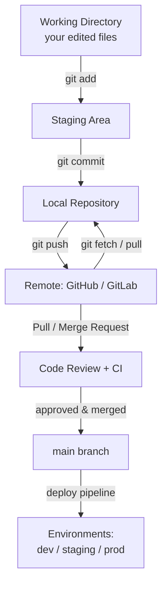

# Git, GitHub & Branching

A practical, example-driven guide to version control with Git — the everyday
commands, how teams collaborate, how branches map to environments, how merges
(and conflicts) actually play out, what GitHub adds on top, and how GitLab
compares as an alternative.

## Contents

| File | What it covers |
|------|----------------|
| [01-Git-and-GitHub.md](./01-Git-and-GitHub.md) | Fundamentals: what Git and GitHub are, core concepts, the three-stage workflow. |
| [02-Common-Git-Operations.md](./02-Common-Git-Operations.md) | The commands you use daily, with real examples and what each one does. |
| [03-Branching-and-Environments.md](./03-Branching-and-Environments.md) | Branching strategies, environment branches, GitFlow vs trunk-based. |
| [04-Merging-and-Conflict-Resolution.md](./04-Merging-and-Conflict-Resolution.md) | Merge vs rebase, fast-forward vs 3-way, resolving conflicts, best practices. |
| [05-Team-Collaboration-Workflows.md](./05-Team-Collaboration-Workflows.md) | What happens when multiple developers work together — full PR walkthrough. |
| [06-GitHub-Features.md](./06-GitHub-Features.md) | What GitHub offers beyond plain Git: PRs, Actions, Issues, protection rules. |
| [07-GitLab-Alternative.md](./07-GitLab-Alternative.md) | GitLab as an alternative — feature-by-feature comparison and migration notes. |

## How it all fits together

## Reading order

1. Start with **01-Git-and-GitHub.md** for the vocabulary and mental model.
2. Practice with **02-Common-Git-Operations.md**.
3. Learn how branches are organized in **03-Branching-and-Environments.md**.
4. Understand integration in **04-Merging-and-Conflict-Resolution.md** and
   **05-Team-Collaboration-Workflows.md**.
5. Use **06-GitHub-Features.md** and **07-GitLab-Alternative.md** as references.

## Related topics

- [Semver](../Semver/Semver.md) — version your releases and tags.
- [Agile Methodology](../Agile-Methodology/README.md) — the process around the code.
- [SonarQube](../SonarQube/SonarQube.md) — code quality gates in your pipeline.

> Diagrams use [Mermaid](https://mermaid.js.org/), which renders natively on
> GitHub and GitLab and in most Markdown viewers.
