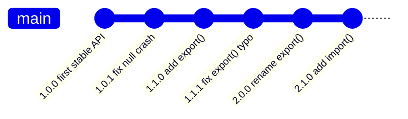
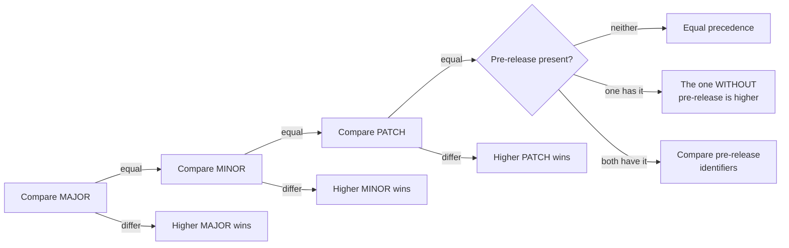

# Semantic Versioning — The Fundamentals

## What is SemVer?

**Semantic Versioning** (SemVer) is a widely adopted convention for assigning
version numbers to software in a way that communicates the **nature of the
changes** in each release. It removes the guesswork around "will this update
break my code?"

The whole idea is a contract between an author and the people depending on their
code: the *number itself* tells you whether an upgrade is safe.

## The Format

```
MAJOR.MINOR.PATCH
  │     │     │
  │     │     └─ Bug fixes (backward-compatible)
  │     └─────── New features (backward-compatible)
  └───────────── Breaking changes (not backward-compatible)
```

Example: `2.4.1` → MAJOR `2`, MINOR `4`, PATCH `1`.

## The Three Numbers

Given a version `MAJOR.MINOR.PATCH`, increment the:

| Part | When to increment | Example |
|------|-------------------|---------|
| **MAJOR** | You make **incompatible / breaking** API changes. | `1.5.2` → `2.0.0` |
| **MINOR** | You add functionality in a **backward-compatible** way. | `1.5.2` → `1.6.0` |
| **PATCH** | You make backward-compatible **bug fixes**. | `1.5.2` → `1.5.3` |

> When you bump MAJOR, reset MINOR and PATCH to 0.
> When you bump MINOR, reset PATCH to 0.

Worked example of a single project's history:



Not sure which one to bump? See
[02-Choosing-the-Right-Bump.md](./02-Choosing-the-Right-Bump.md).

## Pre-release and Build Metadata

SemVer supports two extra labels appended to the core version:

- **Pre-release** — appended with a hyphen: `1.0.0-alpha`, `1.0.0-beta.2`,
  `1.0.0-rc.1`. These have **lower** precedence than the matching stable version.
- **Build metadata** — appended with a plus: `1.0.0+20130313144700`,
  `1.0.0+exp.sha.5114f85`. **Ignored** when determining version precedence.

```
1.0.0-alpha  <  1.0.0-alpha.1  <  1.0.0-beta  <  1.0.0-rc.1  <  1.0.0
```

The full pre-release flow is covered in
[03-Pre-release-Lifecycle.md](./03-Pre-release-Lifecycle.md).

## How precedence is compared

Precedence determines ordering — which version is "newer." It is compared
**field by field, left to right**, numerically:



Build metadata (the `+...` part) is **not** part of this comparison at all:
`1.0.0+build.1` and `1.0.0+build.99` have equal precedence.

## Version 0.x.y — Initial Development

- `0.y.z` is for initial development; **anything may change at any time**.
- The public API should **not** be considered stable.
- Under `0.x`, many ecosystems treat a MINOR bump (`0.3.0` → `0.4.0`) as the
  "breaking" signal, because there is no MAJOR to bump yet.
- Version `1.0.0` defines the first **stable** public API. Releasing `1.0.0` is a
  commitment, not just a milestone.

## Why Use SemVer?

- **Predictability** — consumers know the impact of upgrading before they try it.
- **Dependency management** — tools can safely auto-update within ranges.
- **Communication** — the version itself documents the change.
- **Trust** — breaking changes are never hidden in a minor or patch release.

## Best Practices

- Decide what your **public API** is and document what counts as "breaking".
- Never change a release once published — publish a **new** version instead.
- Tag releases in Git (e.g. `git tag v1.4.0`) — see [05-Release-Workflow.md](./05-Release-Workflow.md).
- Maintain a `CHANGELOG.md` describing changes per version.

## Further Reading

- [Semantic Versioning Specification](https://semver.org/)
- [Keep a Changelog](https://keepachangelog.com/)
