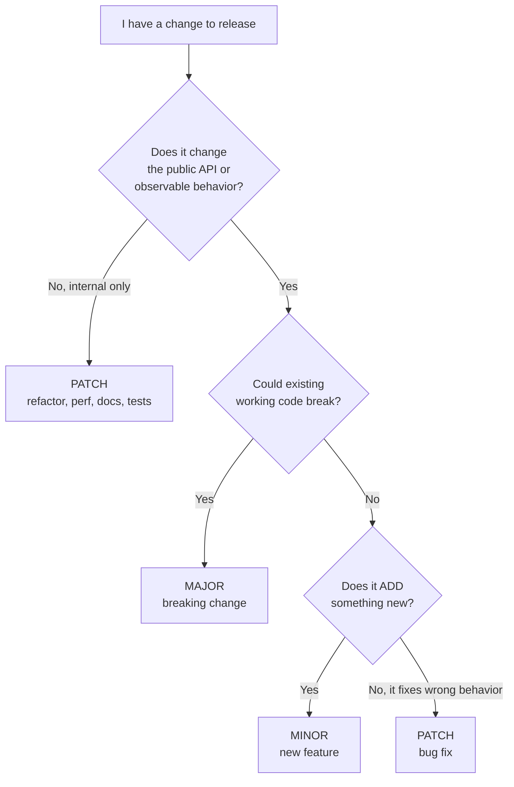
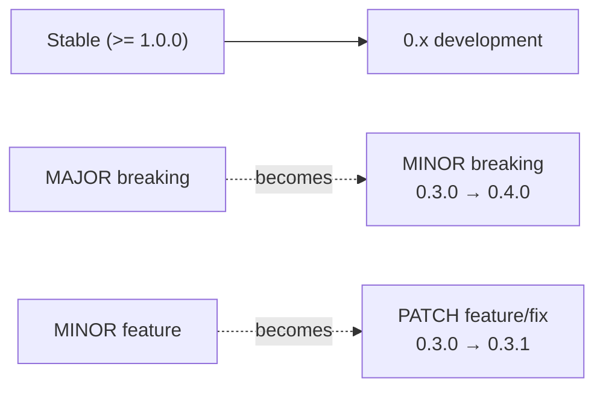

# Choosing the Right Bump

The hardest part of SemVer isn't the format — it's answering *"is this change a
PATCH, a MINOR, or a MAJOR?"* This page gives you a decision flow and a set of
real diffs so you can pattern-match against your own change.

## The decision flow



The pivotal question is the middle one: **"could code that works today stop
working after this change?"** If yes, it's MAJOR — no matter how small the diff.

## PATCH — backward-compatible bug fix

Nothing about the API changes. A caller's code keeps compiling and keeps working;
it just behaves *correctly* now.

```diff
  function divide(a, b) {
-   return a / b;            // returned Infinity for b === 0
+   if (b === 0) throw new RangeError("divide by zero");
+   return a / b;
  }
```

`1.4.2` → `1.4.3`. The signature is unchanged; the bug is fixed.

> Edge case: if consumers *relied* on the buggy behavior (e.g. they catch
> `Infinity`), a fix can technically break them. SemVer's pragmatic answer is
> that depending on a documented bug isn't a supported contract — still PATCH.

## MINOR — backward-compatible new feature

You add capability. Everything that worked before still works; there's just
*more* available now.

```diff
- function formatDate(date) {
-   return date.toISOString();
+ function formatDate(date, { locale } = {}) {
+   if (locale) return date.toLocaleDateString(locale);
+   return date.toISOString();          // unchanged default behavior
  }
```

`1.4.3` → `1.5.0`. Existing callers passing one argument get identical output;
new callers can opt into `locale`.

Adding a brand-new exported function is also MINOR:

```diff
+ export function parseDate(str) { /* ... */ }   // new, nothing else touched
```

## MAJOR — breaking change

Existing, correct usage will break. These are the cases people most often
get wrong by shipping them as MINOR.

**Removing or renaming a public symbol:**

```diff
- export function getUser(id) { /* ... */ }
+ export function fetchUser(id) { /* ... */ }   // callers of getUser() break
```

**Changing a function's signature in an incompatible way:**

```diff
- function createServer(port, host) { /* ... */ }
+ function createServer(options) { /* { port, host } */ }
```

**Changing a default or the shape of returned data:**

```diff
  function listItems() {
-   return items;                 // returned an Array
+   return { items, total };      // now an Object — every caller breaks
  }
```

All of these are `1.x.y` → `2.0.0`.

## A handy lookup table

| Change | Bump | Why |
|--------|------|-----|
| Fix a crash / wrong result, same API | PATCH | Behavior corrected, contract unchanged |
| Improve performance, no API change | PATCH | Invisible to callers |
| Internal refactor, update docs | PATCH | No observable change |
| Add a new optional parameter (with default) | MINOR | Old calls still valid |
| Add a new function / endpoint / config option | MINOR | Pure addition |
| Deprecate (but keep) an API | MINOR | Still works; just warns |
| Remove or rename a public symbol | MAJOR | Old calls break |
| Make an optional parameter required | MAJOR | Old calls break |
| Change return type / data shape | MAJOR | Old consumers misread it |
| Drop support for an old runtime (Node 16) | MAJOR | Old environments break |
| Change defaults that alter behavior | MAJOR | Silent behavior change |

## Under `0.x`, shift everything left

There is no MAJOR to bump, so the convention shifts:



So under `0.x`, treat a **MINOR** bump as your "breaking" signal and **PATCH** as
"everything else." Document this, because tooling like `^0.3.1` resolves to
`>=0.3.1 <0.4.0` — it already assumes minor bumps can break.

See [04-Version-Ranges-in-Practice.md](./04-Version-Ranges-in-Practice.md) for why
that range behaves differently under `0.x`.
