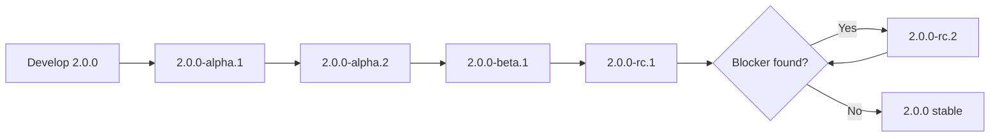
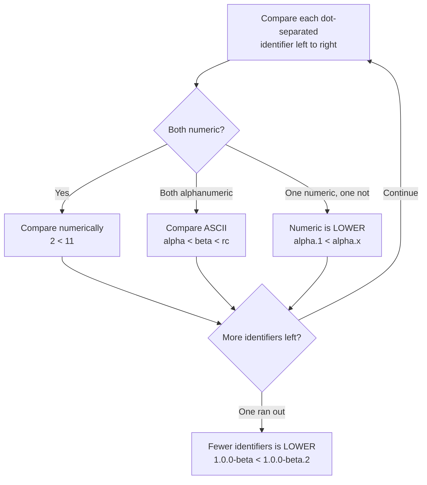

# Pre-release Lifecycle

Before a version is stable enough to ship to everyone, you often want to release
it to early testers. SemVer's **pre-release** labels let you do that *without*
claiming the version is final. This page walks through the `alpha → beta → rc →
stable` flow, the precedence rules, and the exact commands.

## The labels and what they signal

| Label | Meaning | Audience |
|-------|---------|----------|
| `alpha` | Incomplete, may change a lot, expect bugs. | Internal / brave testers |
| `beta` | Feature-complete, still stabilizing. | Early adopters |
| `rc` (release candidate) | Believed shippable; released if no blockers found. | Anyone validating before upgrade |
| *(none)* | Stable release. | Everyone |

A pre-release is written by appending a hyphen and dot-separated identifiers:

```
1.0.0-alpha
1.0.0-alpha.1
1.0.0-beta.2
1.0.0-rc.1
1.0.0            ← the stable release
```

## The flow toward a stable release



The core version (`2.0.0`) stays fixed the whole time — you're stabilizing *that*
release. Only the pre-release identifier moves.

## Precedence: pre-releases are always LOWER

A version *with* a pre-release tag has **lower** precedence than the same version
*without* one. This is the rule that makes the whole scheme work — `1.0.0` is
always "newer" than any `1.0.0-...`.

```
1.0.0-alpha < 1.0.0-alpha.1 < 1.0.0-alpha.beta
            < 1.0.0-beta < 1.0.0-beta.2 < 1.0.0-beta.11
            < 1.0.0-rc.1 < 1.0.0
```

How identifiers are compared, left to right:



Two gotchas hidden in there:

- `beta.2 < beta.11` because numeric identifiers compare as **numbers**, not
  strings. (A naive string sort would put `11` before `2`.)
- `1.0.0-beta < 1.0.0-beta.2` — a **shorter** set of identifiers loses when all
  preceding ones are equal.

## Worked example — shipping `2.0.0`

```bash
# 1. Cut the first alpha for internal testing
npm version 2.0.0-alpha.1
git push --follow-tags
npm publish --tag alpha          # NOT published to the "latest" dist-tag

# 2. Iterate; feature-complete now → beta
npm version 2.0.0-beta.1
npm publish --tag beta

# 3. Believed shippable → release candidate
npm version 2.0.0-rc.1
npm publish --tag rc

# 4. No blockers → cut the stable release
npm version 2.0.0
npm publish                       # now lands on "latest"
```

The `--tag` flag matters: it keeps pre-releases off the default `latest`
dist-tag, so `npm install your-pkg` keeps getting the last *stable* version.
Testers opt in explicitly with `npm install your-pkg@beta`.

## Ranges do not pick up pre-releases by accident

This trips people up constantly. A normal range like `^1.2.3` will **not**
install `2.0.0-beta.1`, even though `2.0.0-beta.1` is numerically "between"
versions:

```
^1.2.3  matches  1.4.0      ✅
^1.2.3  matches  2.0.0-rc.1 ❌  (pre-releases excluded)
```

To receive a pre-release you must ask for one explicitly, e.g. `^2.0.0-rc.1` or
by installing the `@rc` dist-tag. This is deliberate: it stops unfinished
releases from leaking into everyone's `npm install`.

## Build metadata is not a pre-release

`+...` after the version is **build metadata**, not a pre-release. It is ignored
for precedence entirely:

```
1.0.0+20240101  ==  1.0.0+20240615   (equal precedence)
1.0.0-rc.1+sha.5114f85               (pre-release AND build metadata)
```

Use it for traceability — a commit SHA, build number, or timestamp — not to
convey ordering.

See [04-Version-Ranges-in-Practice.md](./04-Version-Ranges-in-Practice.md) for how
these versions are matched by dependency ranges.
