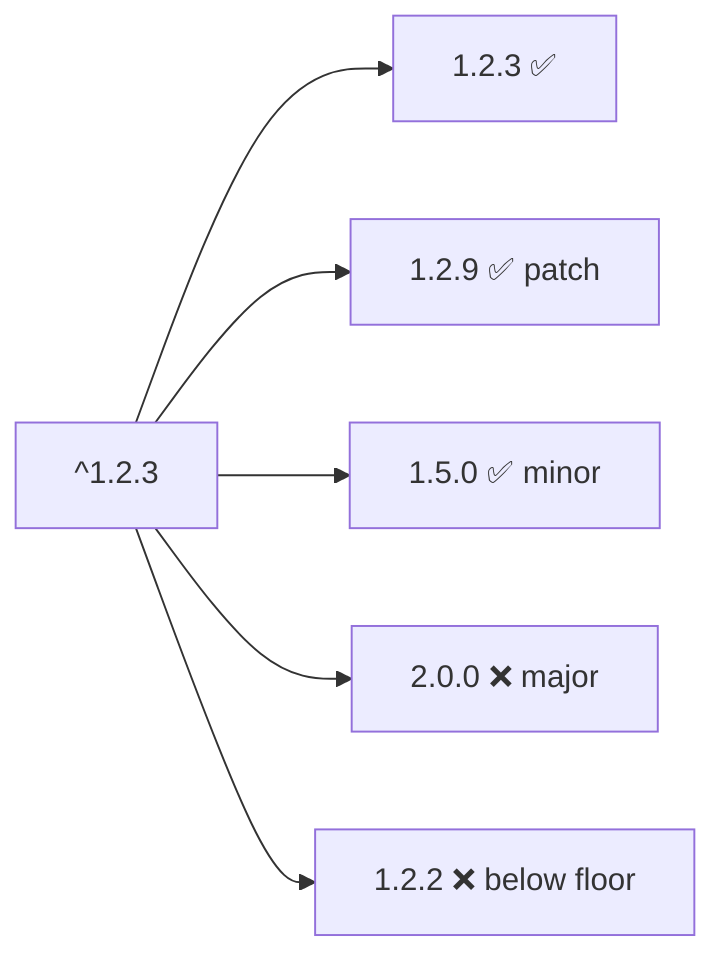
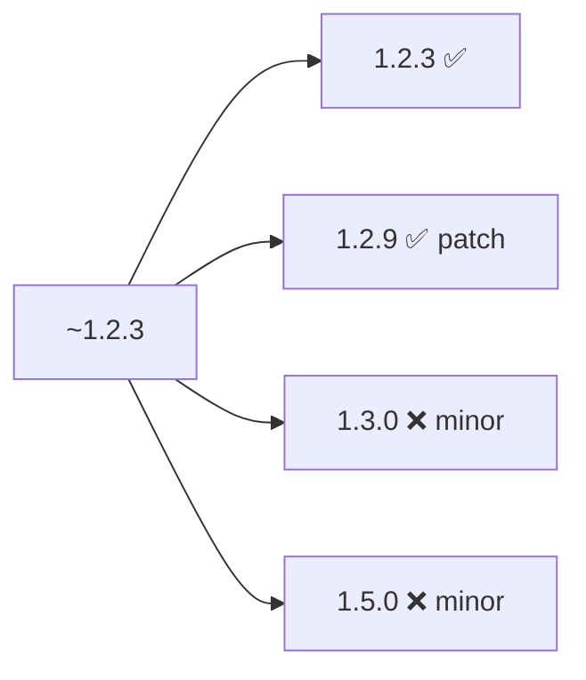
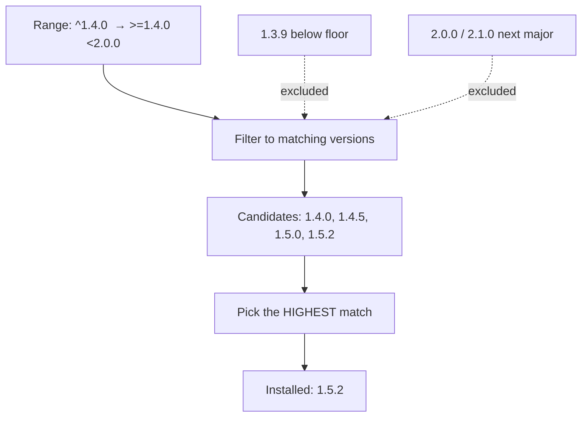
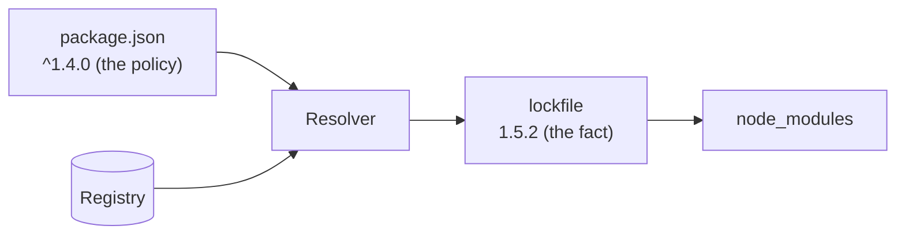

# Version Ranges in Practice

When you declare a dependency, you rarely pin one exact version — you declare a
**range** of acceptable versions and let the package manager pick the best match.
This page shows what the common operators mean and, crucially, *what actually
gets installed*.

## The operators at a glance

| Notation | Resolves to | Allows |
|----------|-------------|--------|
| `1.2.3` | `=1.2.3` | nothing — exact pin |
| `^1.2.3` | `>=1.2.3 <2.0.0` | minor + patch |
| `~1.2.3` | `>=1.2.3 <1.3.0` | patch only |
| `>=1.2.3 <2.0.0` | (literal) | an explicit range |
| `1.2.x` / `1.2.*` | `>=1.2.0 <1.3.0` | patch only |
| `1.x` | `>=1.0.0 <2.0.0` | minor + patch |
| `*` / `latest` | any version | everything (risky) |

`^` (caret) is the npm default and the one to understand first.

## Caret `^` — "compatible with"

`^` lets in anything that *shouldn't* break you under SemVer: any MINOR or PATCH,
but never a new MAJOR.

```
^1.2.3   →   >=1.2.3 <2.0.0
```



## Tilde `~` — "reasonably close"

`~` is stricter: patches only (when a minor is specified).

```
~1.2.3   →   >=1.2.3 <1.3.0
```



Use `~` when you trust patch releases but want to review minors before adopting
them.

## The `0.x` special case

Caret behaves *differently* below `1.0.0`, because under `0.x` a minor bump is
the breaking signal (see [02-Choosing-the-Right-Bump.md](./02-Choosing-the-Right-Bump.md)).

| Range | Resolves to | Note |
|-------|-------------|------|
| `^1.2.3` | `>=1.2.3 <2.0.0` | minor allowed |
| `^0.2.3` | `>=0.2.3 <0.3.0` | **minor locked** — only patches |
| `^0.0.3` | `>=0.0.3 <0.0.4` | **fully locked** — exact version |

So `^0.2.3` behaves like `~0.2.3`. The tooling assumes `0.x` minors break, which
is exactly why you should bump MINOR for breaking changes during `0.x`.

## A resolution walkthrough

Say your `package.json` asks for `^1.4.0`, and the registry currently has:

```
1.3.9, 1.4.0, 1.4.5, 1.5.0, 1.5.2, 2.0.0, 2.1.0
```



The resolver picks `1.5.2` — the highest version satisfying the range.
Pre-releases like `2.0.0-rc.1` are excluded unless you ask for them explicitly.

## Ranges vs the lockfile — the two-layer model

The range in `package.json` says *what is acceptable*. The **lockfile**
(`package-lock.json`, `yarn.lock`, `pnpm-lock.yaml`) records *what was actually
installed*, pinned to an exact version and hash.



- **`npm install`** respects the lockfile if present → reproducible builds.
- **`npm update`** re-resolves the range and rewrites the lockfile → may move
  `1.5.2` up to a newer in-range version like `1.6.0`.

This is why you commit the lockfile for apps: two machines installing the same
range months apart would otherwise get different versions.

## Picking a strategy

| You want... | Use | Trade-off |
|-------------|-----|-----------|
| Reproducible, safe auto-patching | `^` + committed lockfile | Default; best balance |
| Tightest control, review every minor | `~` | More manual upgrades |
| Absolute reproducibility per declaration | exact pin `1.4.0` | Miss security patches; manual bumps |
| Bleeding edge | `*` / `latest` | Builds break unpredictably — avoid |

Rule of thumb: **applications** commit a lockfile and can use `^`; **libraries**
should keep ranges as permissive as is safe (usually `^`) so consumers don't end
up with duplicate, conflicting copies of the same dependency.

## Quick experiments

```bash
# See what a range would resolve to without installing
npm view <pkg> versions --json        # list every published version
npx semver -r "^1.4.0" 1.5.2 2.0.0    # test which versions satisfy a range
```

Or use the interactive [npm semver calculator](https://semver.npmjs.com/).
