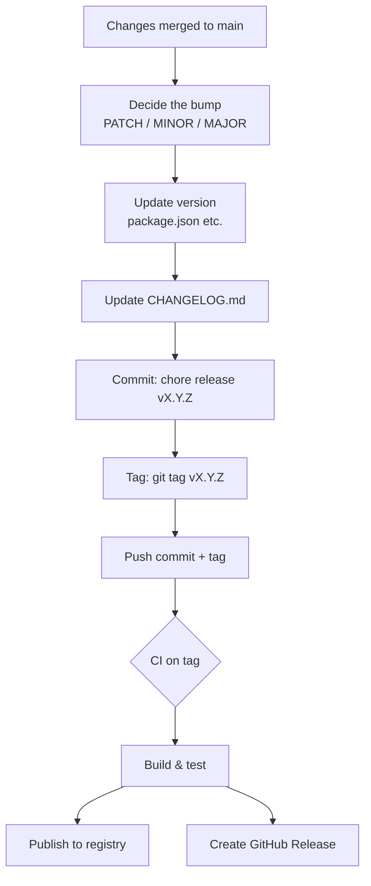
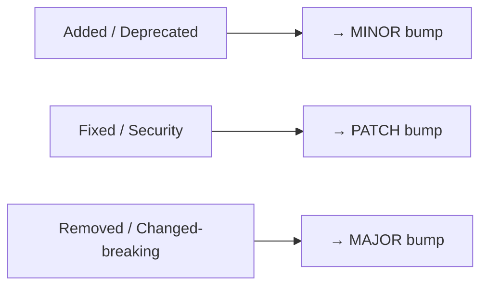
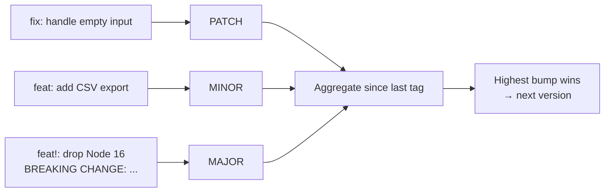

# Release Workflow

Knowing *which* number to bump is half the job. This page covers actually
shipping a release: tagging it in Git, recording it in a changelog, and
automating the whole thing so the version, tag, and changelog never drift apart.

## The end-to-end flow



The key discipline: **one version = one commit = one tag = one changelog entry.**
They move together, always.

## Tagging in Git

Use **annotated** tags (`-a`) for releases — they store a message, author, and
date, unlike lightweight tags.

```bash
# Annotated tag pointing at the release commit
git tag -a v1.4.0 -m "Release 1.4.0: add export() and locale formatting"

# Push the tag (regular git push does NOT push tags)
git push origin v1.4.0

# Or push the commit and all its tags together
git push --follow-tags
```

Convention: prefix tags with `v` (`v1.4.0`). Many tools (GoReleaser, GitHub
Releases) expect this.

```bash
git tag                      # list tags
git show v1.4.0              # inspect a tag + its commit
git tag -d v1.4.0            # delete a local tag (before pushing!)
git push origin :v1.4.0      # delete a pushed tag (avoid once consumed)
```

> Once a tag is pushed and someone has pulled it, treat it as immutable —
> deleting/moving a published tag is the Git equivalent of editing a published
> release. Cut a new version instead.

## Keeping a CHANGELOG

Follow [Keep a Changelog](https://keepachangelog.com/): a human-readable file,
newest version on top, grouped by change type.

```markdown
# Changelog

## [Unreleased]

## [1.4.0] - 2026-06-19
### Added
- `formatDate(date, { locale })` for locale-aware output.
- New `parseDate()` helper.

### Fixed
- `divide()` now throws on divide-by-zero instead of returning Infinity.

## [1.3.0] - 2026-05-30
### Added
- Initial export pipeline.
```

The `### Added / Changed / Deprecated / Removed / Fixed / Security` headings map
neatly onto bump decisions:



## Automating the bump with npm

`npm version` does three things atomically: edits `package.json`, makes a commit,
and creates a tag.

```bash
npm version patch    # 1.4.0 → 1.4.1, commits, tags v1.4.1
npm version minor    # 1.4.1 → 1.5.0
npm version major    # 1.5.0 → 2.0.0
npm version 2.0.0-rc.1 --preid=rc   # explicit pre-release

git push --follow-tags
npm publish
```

## Conventional Commits → automatic versioning

If commit messages follow [Conventional Commits](https://www.conventionalcommits.org/),
tools like **semantic-release** or **changesets** can derive the bump, write the
changelog, tag, and publish — with no human picking a number.



Mapping:

| Commit prefix | Resulting bump |
|---------------|----------------|
| `fix:` | PATCH |
| `feat:` | MINOR |
| `feat!:` / `fix!:` / `BREAKING CHANGE:` footer | MAJOR |
| `chore:`, `docs:`, `refactor:`, `test:` | no release |

The highest-priority change since the last tag wins: one `feat:` among ten
`fix:` commits yields a MINOR.

## A minimal GitHub Actions release job

Triggered when you push a `v*` tag:

```yaml
name: release
on:
  push:
    tags: ["v*"]

jobs:
  publish:
    runs-on: ubuntu-latest
    permissions:
      contents: write        # to create the GitHub Release
    steps:
      - uses: actions/checkout@v4
      - uses: actions/setup-node@v4
        with:
          node-version: 20
          registry-url: https://registry.npmjs.org
      - run: npm ci
      - run: npm test
      - run: npm publish
        env:
          NODE_AUTH_TOKEN: ${{ secrets.NPM_TOKEN }}
      - uses: softprops/action-gh-release@v2   # GitHub Release from the tag
```

## Release checklist

- [ ] All tests green on `main`.
- [ ] Bump decided from the actual diff (see [02-Choosing-the-Right-Bump.md](./02-Choosing-the-Right-Bump.md)).
- [ ] Version updated in the manifest (`package.json`, `Cargo.toml`, …).
- [ ] `CHANGELOG.md` has an entry with today's date.
- [ ] Annotated tag created and pushed.
- [ ] Artifact published; GitHub Release created.
- [ ] Pre-releases published under a non-`latest` tag (see [03-Pre-release-Lifecycle.md](./03-Pre-release-Lifecycle.md)).
