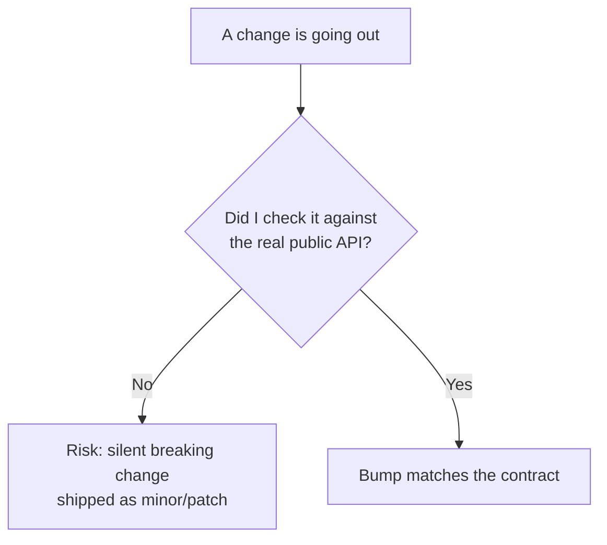
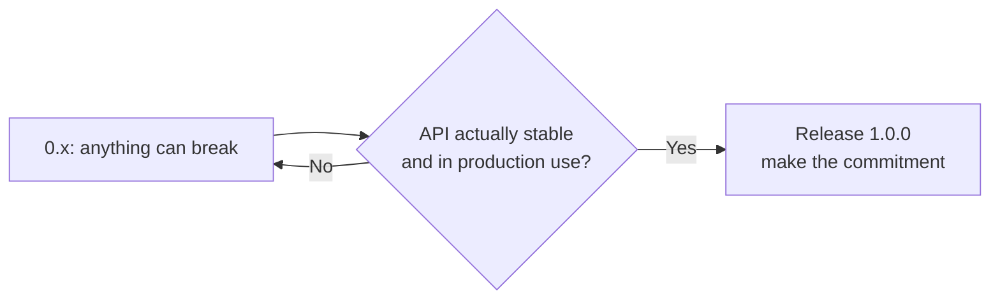

# Common SemVer Mistakes

SemVer is simple to state and surprisingly easy to violate. Most violations
aren't malicious — they're a breaking change shipped as a minor because nobody
noticed. This page collects the pitfalls that quietly break consumers, with the
fix for each.



## 1. Hiding a breaking change in a minor or patch

The cardinal sin. A renamed function, a removed option, a changed default —
shipped as `1.4.0` → `1.4.1`. Every consumer using `^1.4.0` auto-upgrades and
breaks.

```diff
- export function getUser(id) {}     // shipped removal as a PATCH
+ export function fetchUser(id) {}
```

**Fix:** if existing correct code can break, it's MAJOR. No exceptions for "small"
diffs. If you must, deprecate first (a MINOR), then remove later (a MAJOR).

## 2. Treating a changed default as non-breaking

Adding an option is MINOR. *Changing what the option defaults to* is usually
MAJOR, because every caller relying on the old default silently changes behavior.

```diff
- function request(url, { timeout = 0 } = {}) {}       // 0 = no timeout
+ function request(url, { timeout = 30000 } = {}) {}    // now times out at 30s
```

**Fix:** a behavior change with no code change on the caller's side is still
breaking. Bump MAJOR, and call it out loudly in the changelog.

## 3. Forgetting that output shape is part of the API

The signature didn't change, so it "feels" safe — but the *returned data* did.

```diff
  function listItems() {
-   return items;              // Array
+   return { items, total };   // Object — every `items.map(...)` breaks
  }
```

**Fix:** return types, JSON response shapes, error types, and thrown exceptions
are all part of the contract. Changing them is MAJOR.

## 4. Editing a published release instead of bumping

Republishing `1.4.0` with "just a quick fix" means two different artifacts share
one version — caches, lockfiles, and mirrors now disagree about what `1.4.0` is.

**Fix:** releases are immutable. Publish `1.4.1` instead. (npm enforces this; you
*cannot* re-publish the same version.)

## 5. String-sorting pre-releases

Assuming `beta.11` comes before `beta.2` because "1 < 2" as text.

```
1.0.0-beta.2  <  1.0.0-beta.11     ✅ numeric compare
```

**Fix:** numeric pre-release identifiers compare as numbers. Let tooling handle
ordering — see [03-Pre-release-Lifecycle.md](./03-Pre-release-Lifecycle.md).

## 6. Expecting `^` to pull in pre-releases

`^2.0.0` will not install `2.0.0-rc.1`; ranges exclude pre-releases by default.
Teams sometimes "publish the rc" and wonder why nobody got it.

**Fix:** distribute pre-releases under an explicit dist-tag (`npm publish --tag
rc`) and have testers opt in with `@rc`.

## 7. Staying on `0.x` forever

`0.x` means "no stability promised" — so `^0.5.0` locks to patches only, and every
minor can break. Long-lived `0.x` projects make consumers nervous and ranges
overly tight.



**Fix:** when people depend on it in production, ship `1.0.0`. It's a signal of
stability, not perfection.

## 8. Bumping MAJOR for trivial non-API changes

The opposite over-correction: jumping to `2.0.0` for a docs tweak, a dependency
bump, or an internal refactor that consumers can't observe.

**Fix:** if nothing observable to consumers changed, it's PATCH. Reserve MAJOR
for genuine breakage — version inflation erodes the signal.

## 9. Letting tag, version, and changelog drift

Manually editing `package.json` but forgetting the tag, or tagging without a
changelog entry. Now `v1.4.0` the tag, `1.4.0` the manifest, and the changelog
disagree about what shipped.

**Fix:** automate it — `npm version` or Conventional-Commits tooling keeps them
in lockstep. See [05-Release-Workflow.md](./05-Release-Workflow.md).

## 10. Tightening your own ranges as a library author

Pinning your library's dependencies to exact versions (`"lodash": "4.17.21"`)
forces duplicate copies into consumers and causes resolution conflicts.

**Fix:** libraries declare the *widest safe* range (usually `^`); applications
pin reproducibility via the committed lockfile, not the range. See
[04-Version-Ranges-in-Practice.md](./04-Version-Ranges-in-Practice.md).

## The one question that prevents most of these

> **"Could code that works today stop working — or silently behave differently —
> after this change?"**

If yes → MAJOR. If it only adds → MINOR. If it only fixes, invisibly → PATCH.
