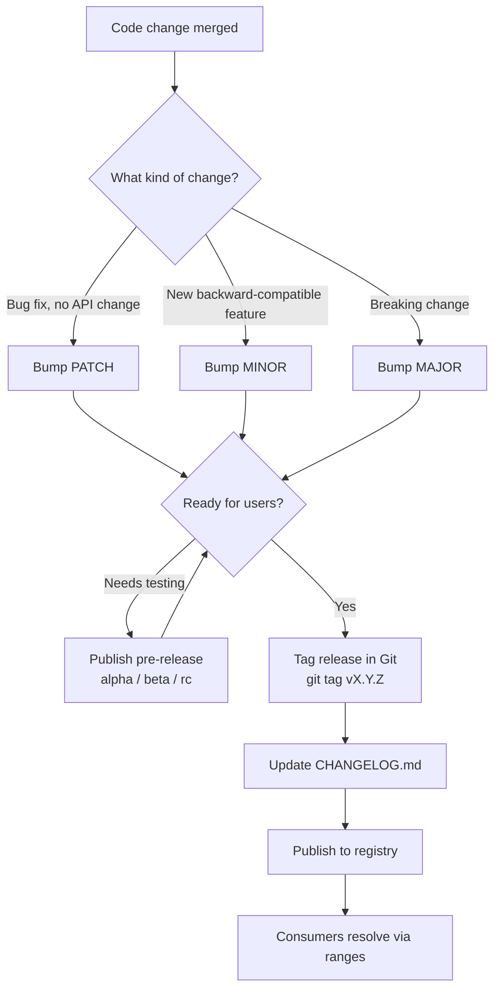

# Semantic Versioning (SemVer)

A practical, example-driven guide to versioning software with SemVer — not just
the `MAJOR.MINOR.PATCH` rule, but how to *decide* a bump from a real diff, how
pre-releases flow toward a stable release, how package managers resolve ranges,
and how to ship a version end-to-end.

## Contents

| File | What it covers |
|------|----------------|
| [01-Semver.md](./01-Semver.md) | The fundamentals: format, the three numbers, precedence, the `0.x` rule. |
| [02-Choosing-the-Right-Bump.md](./02-Choosing-the-Right-Bump.md) | A decision flow with real code diffs — is this PATCH, MINOR, or MAJOR? |
| [03-Pre-release-Lifecycle.md](./03-Pre-release-Lifecycle.md) | `alpha → beta → rc → stable`, precedence rules, worked examples. |
| [04-Version-Ranges-in-Practice.md](./04-Version-Ranges-in-Practice.md) | `^`, `~`, ranges, lockfiles — what actually gets installed. |
| [05-Release-Workflow.md](./05-Release-Workflow.md) | Tagging, changelogs, and automating the bump in CI. |
| [06-Common-Mistakes.md](./06-Common-Mistakes.md) | Pitfalls that quietly break consumers, and how to avoid them. |

## How a version moves through its life

## Reading order

1. Start with **01-Semver.md** for the vocabulary and rules.
2. Use **02-Choosing-the-Right-Bump.md** the next time you're unsure which number to bump.
3. Read **03-Pre-release-Lifecycle.md** and **04-Version-Ranges-in-Practice.md** to
   understand how versions are tested and consumed.
4. Follow **05-Release-Workflow.md** to ship one, and keep **06-Common-Mistakes.md** nearby.

> Diagrams use [Mermaid](https://mermaid.js.org/), which renders natively on
> GitHub and in most Markdown viewers.

## Further reading

- [Semantic Versioning Specification](https://semver.org/)
- [Keep a Changelog](https://keepachangelog.com/)
- [npm semver calculator](https://semver.npmjs.com/)
