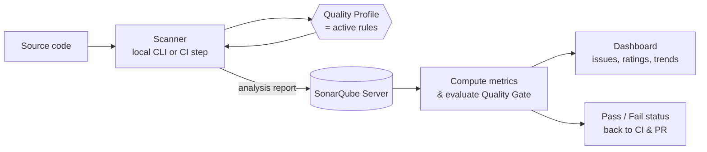
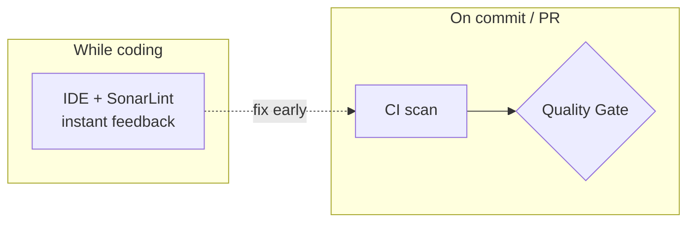

# SonarQube — The Fundamentals

**SonarQube** is a platform for **continuous inspection of code quality**. It
runs automatic *static analysis* — examining source code without executing it —
to detect bugs, security vulnerabilities, and maintainability problems ("code
smells") across 30+ languages. The goal: help teams ship cleaner, safer, more
maintainable code, and keep it that way over time.

> New here? After this page, read [02-Core-Concepts.md](./02-Core-Concepts.md), then
> get a real scan running with
> [03-Running-Your-First-Analysis.md](./03-Running-Your-First-Analysis.md).

## What it analyzes

SonarQube reports on several dimensions of code health:

| Category | What it finds | Example |
|----------|---------------|---------|
| **Bugs** | Code likely to behave incorrectly. | A null pointer dereference, an `if` that's always true. |
| **Vulnerabilities** | Security weaknesses an attacker could exploit. | SQL injection from string-built queries. |
| **Security Hotspots** | Security-sensitive code a human should review. | Use of a crypto algorithm, a hardcoded IP. |
| **Code Smells** | Maintainability issues that make code harder to change. | A 300-line method, duplicated blocks, dead code. |
| **Coverage** | How much code is exercised by tests. | "62% of new lines covered." |
| **Duplications** | Repeated / copy-pasted blocks. | The same 40 lines in three files. |

Bugs, vulnerabilities, and smells are collectively called **issues**. Hotspots
are tracked separately because they need human judgment, not an automatic fix.

## The analysis pipeline

1. A **scanner** runs analysis on your project, locally or in CI.
2. It applies the **Quality Profile** — the set of rules active for each language.
3. The report is sent to the **SonarQube server**, which stores and aggregates it.
4. The server evaluates results against the **Quality Gate** (pass/fail).
5. Results appear on a **dashboard**; the gate status flows back to your PR.

## Two ways to get feedback

- **In CI / on the server** — the authoritative scan, tied to your Quality Gate
  and pull requests. Covered throughout this guide.
- **In your editor — [SonarLint / SonarQube for IDE]** — real-time feedback as
  you type, using the same rules, so you fix issues *before* you even commit.

## Editions and variants

| Product | Hosting | Notes |
|---------|---------|-------|
| **SonarQube Community** | Self-hosted, free | Core analysis; single branch. |
| **SonarQube Developer / Enterprise** | Self-hosted, paid | Branch & PR analysis, more languages, portfolios. |
| **SonarQube Cloud** (formerly SonarCloud) | SaaS | Hosted by SonarSource; free for public repos. |
| **SonarQube for IDE** (formerly SonarLint) | Editor plugin | Real-time, in-editor analysis. |

> Branch and Pull Request decoration (the gate status posted onto a PR) is a
> **Developer Edition+** / **Cloud** feature. The Community Edition analyzes the
> main branch only — useful to know before you design a PR-blocking workflow in
> [05-CI-CD-Integration.md](./05-CI-CD-Integration.md).

## Why teams use it

- Catches bugs and vulnerabilities **early**, before they reach production.
- Enforces **consistent** standards across a whole team automatically.
- Turns "is this code good?" into **objective, measurable** metrics.
- Steadily **reduces technical debt** by holding new code to a clean bar.

## Further reading

- [SonarQube Documentation](https://docs.sonarsource.com/sonarqube/)
- [Supported languages](https://docs.sonarsource.com/sonarqube/latest/analyzing-source-code/languages/overview/)
- [Clean as You Code](https://www.sonarsource.com/solutions/clean-as-you-code/)
