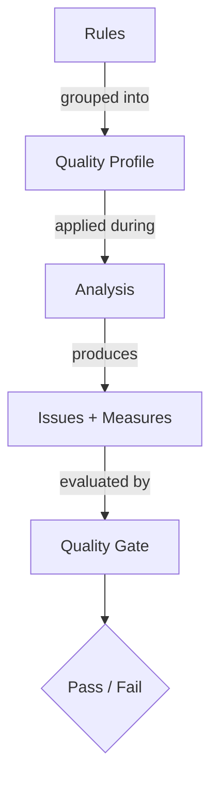
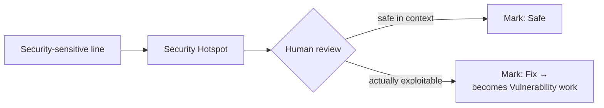
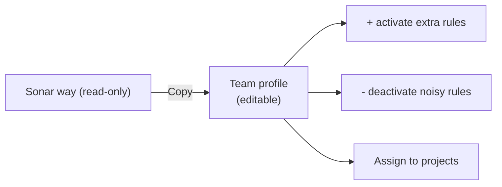
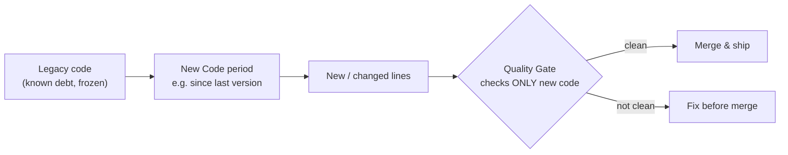

# Core Concepts

These are the words you'll see all over the SonarQube UI. Understanding them is
the difference between "the build is red and I don't know why" and "the gate
failed because coverage on new code dropped below 80%."



## Issues: bug, vulnerability, code smell

Every problem SonarQube raises is an **issue** with a **type** and a
**severity**.

| Type | Meaning |
|------|---------|
| **Bug** | Code that is demonstrably wrong and will likely misbehave. |
| **Vulnerability** | A security flaw that is exploitable. |
| **Code Smell** | Maintainability problem — works today, painful tomorrow. |

| Severity | Use it for |
|----------|------------|
| **Blocker** | High-probability bug / security hole; fix now. |
| **Critical** | Likely bug or security-sensitive smell. |
| **Major** | Quality defect that hurts productivity. |
| **Minor** | Worth fixing, low impact. |
| **Info** | Neither bug nor smell, just a note. |

> Newer SonarQube versions add a **Clean Code taxonomy** (software qualities like
> *Reliability*, *Security*, *Maintainability*, with impact severities
> High/Medium/Low). The classic type/severity model above still appears in many
> views and APIs, so both are worth recognizing.

### Anatomy of one issue

```
Rule:      java:S2259  "Null pointers should not be dereferenced"
Type:      Bug          Severity: Major
File:      OrderService.java   Line: 142
Effort:    10min        (estimated time to fix)
Message:   "order" is nullable here and is dereferenced.
```

Issues carry a **resolution** when you act on them: *Fixed*, *Won't Fix*, or
*False Positive*. Marking something *Won't Fix* removes it from your debt without
silencing the rule everywhere.

## Security Hotspots vs. Vulnerabilities

A **vulnerability** is something SonarQube is confident is exploitable. A
**Security Hotspot** is *security-sensitive code that needs a human to decide*.



Example hotspot: `Math.random()` used to generate a value. Fine for a UI
animation, dangerous for a password-reset token. SonarQube can't know which —
so it asks you.

## Quality Profile — *which rules run*

A **Quality Profile** is the set of rules activated for a language. Each language
ships with a built-in default profile called **"Sonar way"**. You customize by
copying it and adding/removing rules.



Practical rule of thumb: start from "Sonar way", and only deactivate a rule when
the whole team agrees it's noise — document *why* in the profile's notes.

## Quality Gate — *did this analysis pass?*

A **Quality Gate** is a set of pass/fail **conditions** checked after every
analysis. The default gate, **"Sonar way"**, focuses entirely on **new code**:

| Condition (on New Code) | Default |
|-------------------------|---------|
| New issues | = 0 (no new bugs/vulns/smells of high impact) |
| Coverage on new code | ≥ 80% |
| Duplicated lines on new code | ≤ 3% |
| Security Hotspots reviewed | 100% |

If any condition fails, the gate is **red** and CI can block the merge. Full
worked examples live in
[04-Quality-Gates-in-Practice.md](./04-Quality-Gates-in-Practice.md).

## The rating metrics (A–E)

SonarQube summarizes each quality dimension as a letter grade:

| Rating | Reliability (bugs) | Security (vulns) | Maintainability (debt ratio) |
|--------|--------------------|------------------|------------------------------|
| **A** | 0 bugs | 0 vulnerabilities | ≤ 5% |
| **B** | ≥1 Minor bug | ≥1 Minor vuln | 6–10% |
| **C** | ≥1 Major bug | ≥1 Major vuln | 11–20% |
| **D** | ≥1 Critical bug | ≥1 Critical vuln | 21–50% |
| **E** | ≥1 Blocker bug | ≥1 Blocker vuln | > 50% |

The **Maintainability rating** is driven by the **technical debt ratio** =
estimated time to fix all smells ÷ estimated time to have written the code from
scratch.

## Clean as You Code

The central philosophy: **don't try to fix everything at once.** Hold *new and
changed* code to a high standard, and the overall quality rises as the codebase
naturally turns over.



This is why the default gate measures "coverage **on new code**", not total
coverage — a 10-year-old codebase at 30% coverage can still adopt SonarQube
today and improve from here without a hopeless "boil the ocean" cleanup.

**Next:** see the gate in action in
[04-Quality-Gates-in-Practice.md](./04-Quality-Gates-in-Practice.md), or get a scan
running via [03-Running-Your-First-Analysis.md](./03-Running-Your-First-Analysis.md).
