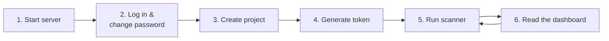
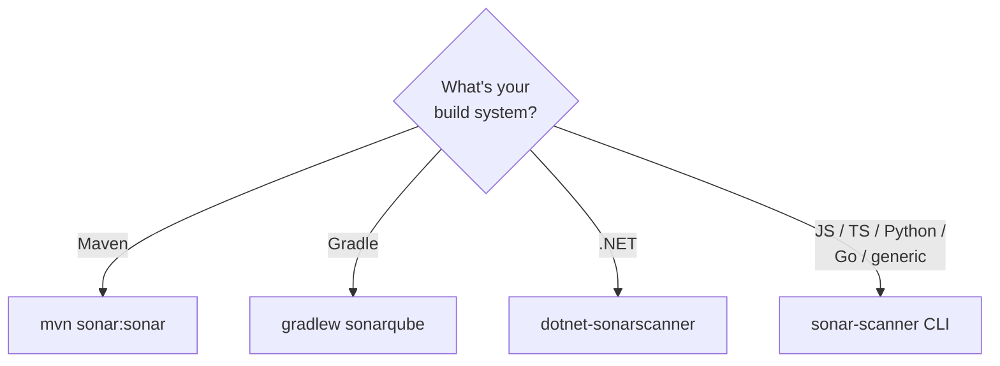
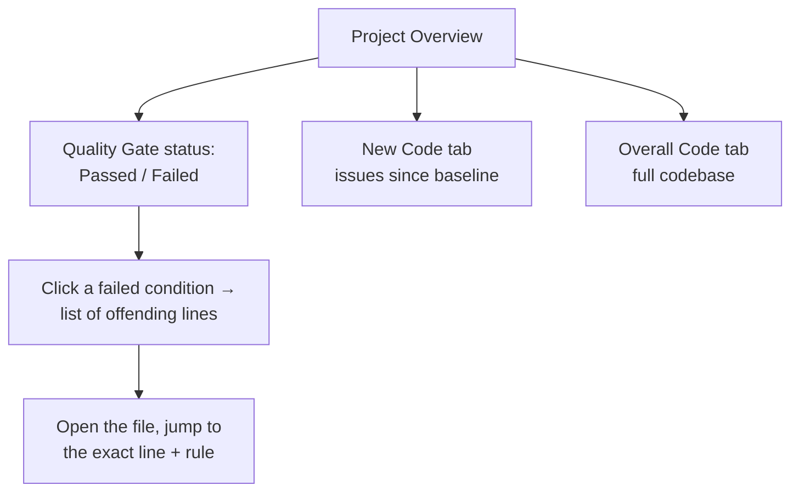

# Running Your First Analysis

This page takes you from nothing to a real scan on a dashboard: start a server,
log in, create a project + token, then run the scanner for your language.



## 1. Start a server with Docker

The fastest way to a local SonarQube is Docker. This is for **evaluation** — the
embedded H2 database is not for production (use PostgreSQL for that).

```bash
docker run -d --name sonarqube \
  -p 9000:9000 \
  sonarqube:community
```

Wait ~1 minute, then open <http://localhost:9000>. Default login is
`admin` / `admin`; you'll be forced to change the password on first sign-in.

> If the container exits immediately on Linux, it's almost always
> `vm.max_map_count`. Fix with `sudo sysctl -w vm.max_map_count=524288`.

## 2. Create a project and a token

In the UI: **Projects → Create Project → Local project**. Give it a *project
key* (e.g. `my-app`) — this key is what the scanner reports against.

Then generate an analysis token: **My Account → Security → Generate Token**.
Copy it; you won't see it again. Treat it like a password.

```bash
# Keep the token out of your shell history and your repo:
export SONAR_TOKEN="sqp_xxxxxxxxxxxxxxxxxxxx"
export SONAR_HOST_URL="http://localhost:9000"
```

## 3. Run the scanner

Which scanner you use depends on your build system. The pattern is always the
same: point it at the server with the token, give it the project key.



### Generic CLI — JS/TS, Python, Go, PHP, etc.

Install the [SonarScanner CLI], then add a `sonar-project.properties` file to
your repo root:

```properties
# sonar-project.properties
sonar.projectKey=my-app
sonar.projectName=My App
sonar.sources=src
sonar.tests=tests
sonar.sourceEncoding=UTF-8

# Language-specific coverage (see Coverage-and-Test-Reports.md):
sonar.javascript.lcov.reportPaths=coverage/lcov.info
sonar.python.coverage.reportPaths=coverage.xml
```

Run it from the repo root:

```bash
sonar-scanner \
  -Dsonar.host.url="$SONAR_HOST_URL" \
  -Dsonar.token="$SONAR_TOKEN"
```

### Java — Maven

No properties file needed; pass config on the command line or in `pom.xml`:

```bash
mvn clean verify sonar:sonar \
  -Dsonar.projectKey=my-app \
  -Dsonar.host.url="$SONAR_HOST_URL" \
  -Dsonar.token="$SONAR_TOKEN"
```

> Run `verify` (or at least `test`) **before** `sonar:sonar` so JaCoCo has
> produced a coverage report for SonarQube to import.

### Java / Kotlin — Gradle

```kotlin
// build.gradle.kts
plugins {
    id("org.sonarqube") version "5.+"
}

sonar {
    properties {
        property("sonar.projectKey", "my-app")
    }
}
```

```bash
./gradlew test sonar \
  -Dsonar.host.url="$SONAR_HOST_URL" \
  -Dsonar.token="$SONAR_TOKEN"
```

### .NET — dotnet-sonarscanner

The .NET scanner wraps your build in begin/end steps:

```bash
dotnet tool install --global dotnet-sonarscanner

dotnet sonarscanner begin \
  /k:"my-app" \
  /d:sonar.host.url="$SONAR_HOST_URL" \
  /d:sonar.token="$SONAR_TOKEN" \
  /d:sonar.cs.opencover.reportsPaths="**/coverage.opencover.xml"

dotnet build --no-incremental
dotnet test --collect:"XPlat Code Coverage"

dotnet sonarscanner end /d:sonar.token="$SONAR_TOKEN"
```

## 4. Read the dashboard

After the scan finishes, refresh the project in the UI. You'll land on the
**Overview**, split into **New Code** and **Overall Code**:



Click any number (e.g. "12 Bugs") to drill into the **Issues** list. Each issue
links to the exact line, explains the rule, and often shows a compliant code
example. From there, [07-Fixing-Issues-and-Code-Smells.md](./07-Fixing-Issues-and-Code-Smells.md)
walks through resolving the common ones.

## Common first-scan gotchas

| Symptom | Cause / fix |
|---------|-------------|
| "Not authorized" | Token wrong, expired, or lacks *Execute Analysis* permission. |
| 0% coverage despite tests | Coverage report not generated or path wrong — see [06-Coverage-and-Test-Reports.md](./06-Coverage-and-Test-Reports.md). |
| No issues at all on a big repo | `sonar.sources` points at the wrong dir, or files were excluded. |
| Analysis "succeeds" but no Java issues | You scanned without compiling; Java analysis needs compiled `.class` files (`sonar.java.binaries`). |
| Gate always "passes" on a new project | No New Code baseline yet — the first scan *is* the baseline. |

**Next:** automate this so it runs on every PR —
[05-CI-CD-Integration.md](./05-CI-CD-Integration.md).

[SonarScanner CLI]: https://docs.sonarsource.com/sonarqube/latest/analyzing-source-code/scanners/sonarscanner/
[SonarLint / SonarQube for IDE]: https://www.sonarsource.com/products/sonarlint/
