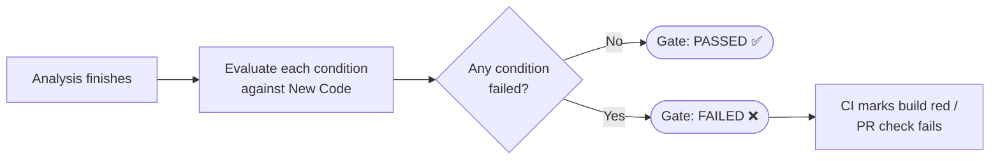
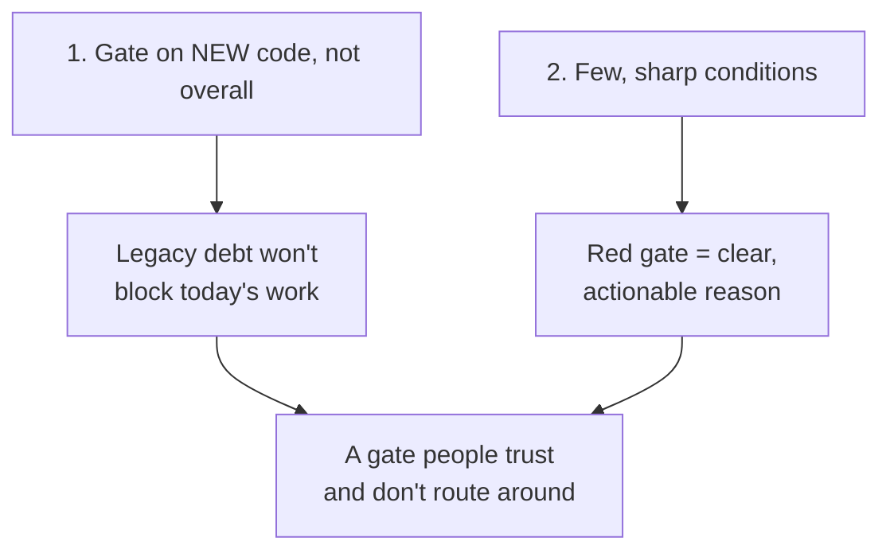
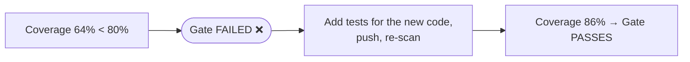

# Quality Gates in Practice

A **Quality Gate** turns "is this good enough to merge?" into an automatic
yes/no. This page shows how to design the conditions and walks through worked
pass/fail scenarios.



## The default gate: "Sonar way"

Every SonarQube ships with a built-in, read-only gate called **Sonar way**. It
is deliberately focused on **New Code** (see *Clean as You Code* in
[02-Core-Concepts.md](./02-Core-Concepts.md)):

| Condition (on New Code) | Operator | Value |
|-------------------------|----------|-------|
| New issues | is greater than | 0 |
| Coverage | is less than | 80.0% |
| Duplicated lines (%) | is greater than | 3.0% |
| Security Hotspots Reviewed | is less than | 100% |

If you change nothing else, this is what blocks your PRs. For most teams it's a
sensible starting point — don't replace it until you've felt where it pinches.

## Designing your own gate

Copy "Sonar way" (**Quality Gates → Create / Copy**) and adjust. Two design
principles keep a gate effective:



### Good conditions vs. traps

| Condition | Verdict | Why |
|-----------|---------|-----|
| Coverage on New Code ≥ 80% | ✅ Good | Drives tests where it matters, ignores legacy. |
| Reliability rating on New Code = A | ✅ Good | No new bugs allowed in. |
| Security Hotspots reviewed = 100% | ✅ Good | Forces a human decision on sensitive code. |
| **Overall** coverage ≥ 80% | ⚠️ Trap | Unachievable on legacy code → team disables the gate. |
| Total issues = 0 | ⚠️ Trap | A decade of debt blocks every PR forever. |
| Maintainability rating = A overall | ⚠️ Trap | Same problem; punishes new work for old sins. |

## What is "New Code"?

The gate only works if SonarQube knows which lines are *new*. Set the **New Code
definition** per project (**Project Settings → New Code**):

| Definition | Best for |
|------------|----------|
| **Previous version** | Projects with releases; resets each version bump. |
| **Number of days** | Steady streams of work (e.g. "last 30 days"). |
| **Reference branch** | PR workflows — compares the PR branch against `main`. |
| **Specific analysis** | Pinning a baseline at a known good point. |

For PR-based teams, **Reference branch = `main`** is usually the right answer:
each PR is judged only on what it changed.

## Worked example A — gate FAILS

A developer adds a feature in a PR. The scan reports on the new code:

```
New Code (this PR):
  Coverage ................. 64.0%   (gate wants >= 80%)   ❌
  New Bugs ................. 0                              ✅
  New Vulnerabilities ...... 0                              ✅
  Duplicated lines ......... 1.2%    (gate wants <= 3%)    ✅
  Hotspots reviewed ........ 100%                           ✅
```



Result: the PR check is red. The fix is *not* to lower the threshold — it's to
add tests for the new lines. See
[06-Coverage-and-Test-Reports.md](./06-Coverage-and-Test-Reports.md).

## Worked example B — gate PASSES with old debt present

Same project has 4,000 pre-existing code smells. A PR fixes a typo in a log
message and touches no other code:

```
Overall Code: 4000 smells, 31% coverage   (irrelevant to the gate)
New Code:      0 new issues, no new uncovered lines
```

Gate: **PASSED ✅** — because it judges only the changed lines. This is *Clean as
You Code* working as intended: the mountain of legacy debt doesn't block a
one-line fix, but the moment you add risky new code, the gate catches it.

## Failing the build on a red gate

To make CI actually block on the gate, the scanner must **wait** for the server's
verdict and return a non-zero exit code:

```properties
# sonar-project.properties
sonar.qualitygate.wait=true
```

```bash
# Maven equivalent
mvn sonar:sonar -Dsonar.qualitygate.wait=true
```

With `sonar.qualitygate.wait=true`, the scanner polls until the gate is computed
and exits `1` if it failed — which fails the CI job. Wiring this into specific
platforms is covered in [05-CI-CD-Integration.md](./05-CI-CD-Integration.md).

## Recommended starting gate

For a team adopting SonarQube on an existing codebase:

| Condition (New Code) | Value |
|----------------------|-------|
| Coverage | ≥ 80% |
| Duplicated lines | ≤ 3% |
| Reliability rating | A (no new bugs) |
| Security rating | A (no new vulnerabilities) |
| Security Hotspots reviewed | 100% |

Ship with this, watch it for a few sprints, and only then tune. A gate the team
trusts is worth more than a perfect gate they've learned to ignore.
