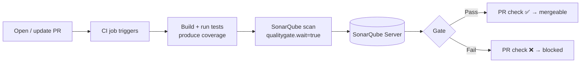
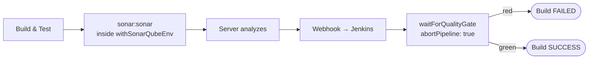
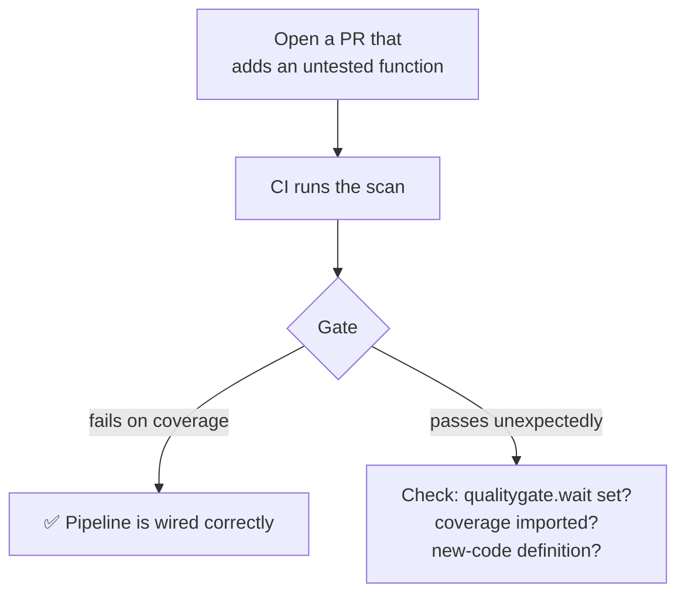

# CI/CD Integration

The real value of SonarQube shows up when it runs **automatically on every push
and pull request**, and a failing Quality Gate blocks the merge. This page has
working pipeline snippets for the four most common platforms.



## Prerequisites (all platforms)

1. A reachable SonarQube server URL (`SONAR_HOST_URL`).
2. An analysis **token** stored as a CI secret (`SONAR_TOKEN`) — never in the repo.
3. Tests run **before** the scan so a coverage report exists
   (see [06-Coverage-and-Test-Reports.md](./06-Coverage-and-Test-Reports.md)).
4. `sonar.qualitygate.wait=true` so the job fails on a red gate
   (see [04-Quality-Gates-in-Practice.md](./04-Quality-Gates-in-Practice.md)).

> **Edition note:** automatic PR *decoration* (the gate status posted onto the
> PR) requires SonarQube **Developer Edition+** or **SonarQube Cloud**. On
> Community Edition you still get the build pass/fail, just not the inline PR
> comment.

## GitHub Actions

A JS/TS project that tests, then scans:

```yaml
# .github/workflows/sonarqube.yml
name: SonarQube
on:
  push:
    branches: [main]
  pull_request:
    types: [opened, synchronize, reopened]

jobs:
  sonarqube:
    runs-on: ubuntu-latest
    steps:
      - uses: actions/checkout@v4
        with:
          fetch-depth: 0          # full history → accurate new-code & blame

      - uses: actions/setup-node@v4
        with: { node-version: 20, cache: npm }

      - run: npm ci
      - run: npm test -- --coverage   # writes coverage/lcov.info

      - name: SonarQube Scan
        uses: SonarSource/sonarqube-scan-action@v4
        env:
          SONAR_TOKEN: ${{ secrets.SONAR_TOKEN }}
          SONAR_HOST_URL: ${{ secrets.SONAR_HOST_URL }}
        with:
          args: >
            -Dsonar.qualitygate.wait=true
```

> `fetch-depth: 0` matters: a shallow clone breaks SonarQube's ability to assign
> new code to the right author and to diff against the reference branch.

To make the gate **required**, add the resulting check (e.g. "SonarQube Code
Analysis") to your branch protection rules.

## GitLab CI

GitLab integrates tightly — the scan can post results straight into the MR
widget.

```yaml
# .gitlab-ci.yml
sonarqube-check:
  image: sonarsource/sonar-scanner-cli:latest
  variables:
    SONAR_USER_HOME: "${CI_PROJECT_DIR}/.sonar"
    GIT_DEPTH: "0"               # full history
  cache:
    key: "${CI_JOB_NAME}"
    paths: [.sonar/cache]
  script:
    - sonar-scanner -Dsonar.qualitygate.wait=true
  allow_failure: false           # red gate fails the pipeline
  rules:
    - if: $CI_PIPELINE_SOURCE == 'merge_request_event'
    - if: $CI_COMMIT_BRANCH == 'main'
```

Set `SONAR_HOST_URL` and `SONAR_TOKEN` under **Settings → CI/CD → Variables**
(mask the token).

## Jenkins

Using the **SonarQube Scanner** plugin, which provides `withSonarQubeEnv` and
the `waitForQualityGate` step:

```groovy
// Jenkinsfile
pipeline {
  agent any
  stages {
    stage('Build & Test') {
      steps { sh 'mvn -B clean verify' }   // JaCoCo report produced here
    }
    stage('SonarQube Analysis') {
      steps {
        withSonarQubeEnv('My SonarQube Server') {   // configured in Jenkins
          sh 'mvn sonar:sonar'
        }
      }
    }
    stage('Quality Gate') {
      steps {
        timeout(time: 10, unit: 'MINUTES') {
          waitForQualityGate abortPipeline: true     // fail build on red gate
        }
      }
    }
  }
}
```



`waitForQualityGate` relies on a **webhook** from SonarQube back to Jenkins —
configure it under **Administration → Configuration → Webhooks** pointing at
`https://<jenkins>/sonarqube-webhook/`.

## Azure DevOps

Install the **SonarQube** extension, then use the three tasks (Prepare → run
build/tests → Analyze → Publish):

```yaml
# azure-pipelines.yml
trigger: [main]

pool:
  vmImage: ubuntu-latest

steps:
  - task: SonarQubePrepare@6
    inputs:
      SonarQube: 'My-SonarQube-Service-Connection'
      scannerMode: 'CLI'
      configMode: 'file'        # uses sonar-project.properties

  - script: |
      npm ci
      npm test -- --coverage
    displayName: 'Test'

  - task: SonarQubeAnalyze@6

  - task: SonarQubePublish@6
    inputs:
      pollingTimeoutSec: '300'  # waits for the Quality Gate result
```

## Verifying it works



A deliberately-broken PR is the best smoke test: if a function with no tests
*doesn't* turn the gate red, something in the chain isn't connected — start with
whether coverage is actually being imported
([06-Coverage-and-Test-Reports.md](./06-Coverage-and-Test-Reports.md)).
