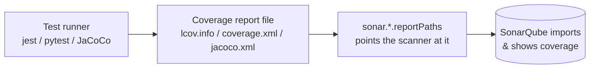
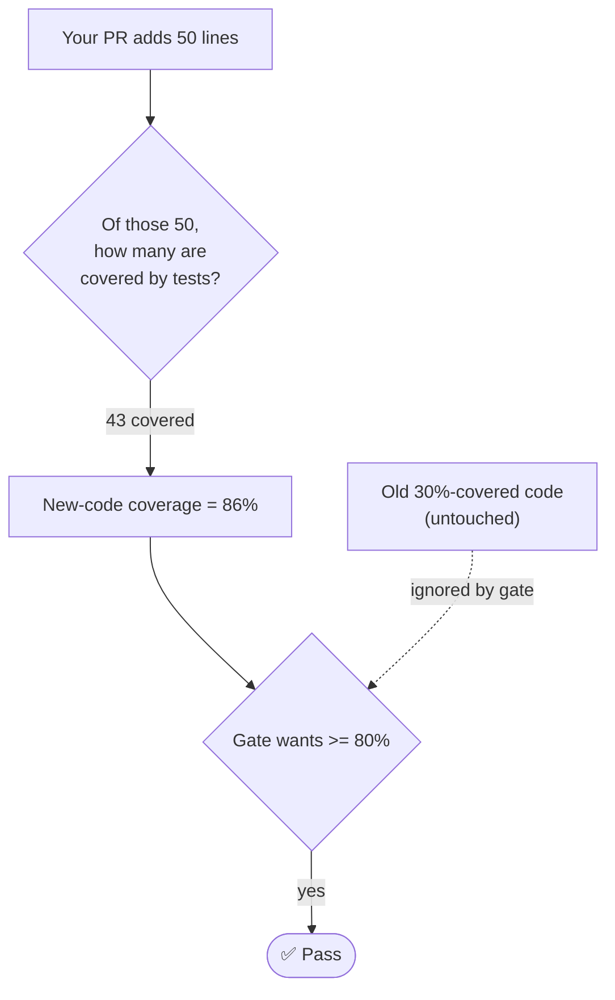
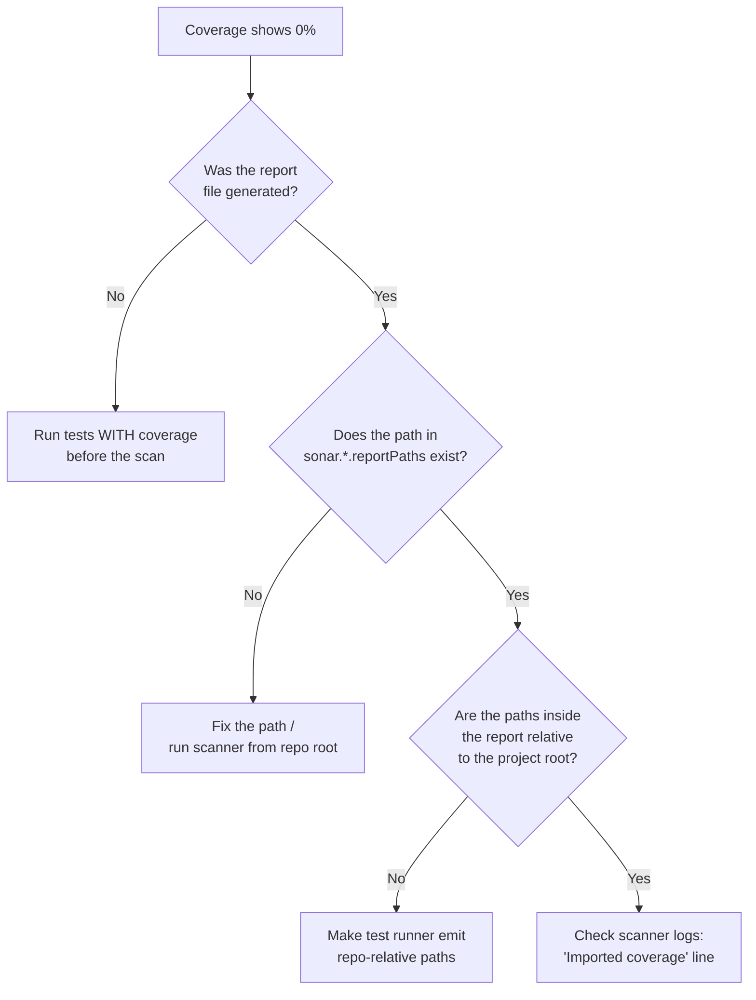

# Coverage and Test Reports

SonarQube does **not** run your tests or measure coverage itself. Your test
runner produces a coverage report; SonarQube **imports** it. Get the path wrong
and you'll see a confusing **0.0%** even though your tests pass — this is the
single most common first-scan surprise.



The golden rule: **run tests with coverage *before* the scan**, and point the
matching `sonar.*.report*Paths` property at the generated file.

## JavaScript / TypeScript — Jest (LCOV)

Configure Jest to emit `lcov`:

```js
// jest.config.js
module.exports = {
  collectCoverage: true,
  coverageReporters: ['lcov', 'text-summary'],
  collectCoverageFrom: ['src/**/*.{js,ts}', '!**/*.d.ts'],
};
```

```properties
# sonar-project.properties
sonar.sources=src
sonar.tests=src
sonar.test.inclusions=**/*.test.ts,**/*.spec.ts
sonar.javascript.lcov.reportPaths=coverage/lcov.info
```

```bash
npm test -- --coverage   # writes coverage/lcov.info
sonar-scanner
```

## Java — Maven + JaCoCo

Attach the JaCoCo agent so a report is written during `test`:

```xml
<!-- pom.xml -->
<plugin>
  <groupId>org.jacoco</groupId>
  <artifactId>jacoco-maven-plugin</artifactId>
  <version>0.8.12</version>
  <executions>
    <execution><goals><goal>prepare-agent</goal></goals></execution>
    <execution>
      <id>report</id>
      <phase>test</phase>
      <goals><goal>report</goal></goals>
    </execution>
  </executions>
</plugin>
```

The Sonar Maven plugin auto-detects `target/site/jacoco/jacoco.xml`, so usually
no extra property is needed. To be explicit:

```properties
sonar.coverage.jacoco.xmlReportPaths=target/site/jacoco/jacoco.xml
```

```bash
mvn clean verify sonar:sonar    # verify runs tests → JaCoCo report
```

> Import the **XML** report (`jacoco.xml`), not the binary `.exec` file —
> SonarQube reads the XML.

## Python — pytest + coverage.py (Cobertura XML)

```bash
pip install pytest pytest-cov
pytest --cov=myapp --cov-report=xml      # writes coverage.xml
```

```properties
# sonar-project.properties
sonar.sources=myapp
sonar.tests=tests
sonar.python.coverage.reportPaths=coverage.xml
```

## .NET — coverlet (OpenCover)

```bash
dotnet test --collect:"XPlat Code Coverage" \
  -- DataCollectionRunSettings.DataCollectors.DataCollector.Configuration.Format=opencover
```

```properties
sonar.cs.opencover.reportsPaths=**/coverage.opencover.xml
```

(With the `dotnet-sonarscanner` begin/end flow from
[03-Running-Your-First-Analysis.md](./03-Running-Your-First-Analysis.md), pass
this as `/d:sonar.cs.opencover.reportsPaths=...`.)

## Go (Cobertura via gocover-cobertura)

```bash
go test ./... -coverprofile=coverage.out
go run github.com/boumenot/gocover-cobertura < coverage.out > coverage.xml
```

```properties
sonar.go.coverage.reportPaths=coverage.out
```

## Coverage on New Code vs. Overall

The default Quality Gate measures **coverage on new code**, not overall. This is
why a legacy project at 30% overall can still adopt an 80% gate today:



You only need to test the lines you *touch*. See *Clean as You Code* in
[02-Core-Concepts.md](./02-Core-Concepts.md).

## Excluding files from coverage

Generated code, DTOs, and migrations shouldn't drag your numbers down or get
flagged:

```properties
# Don't count these toward coverage:
sonar.coverage.exclusions=**/migrations/**,**/*.config.js,**/dto/**

# Don't analyze these at all (no issues raised):
sonar.exclusions=**/vendor/**,**/*.generated.ts

# Files that ARE tests (so test-only rules apply):
sonar.test.inclusions=**/*.test.ts,**/*.spec.ts
```

> Use `coverage.exclusions` to keep code in the analysis but out of the coverage
> math. Use `exclusions` only when you want SonarQube to ignore the file
> entirely — don't reach for it just to game a coverage number.

## Debugging 0% coverage



Run the scanner with `-X` (debug) and look for a line like
`Importing X coverage report(s)`. If it says it imported zero, the path is
wrong; if it imported the report but coverage is still 0%, the file paths
*inside* the report don't match what SonarQube analyzed (usually an absolute vs.
relative path mismatch).

**Next:** with coverage flowing, tune what blocks a merge in
[04-Quality-Gates-in-Practice.md](./04-Quality-Gates-in-Practice.md).
