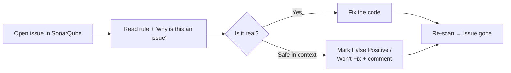
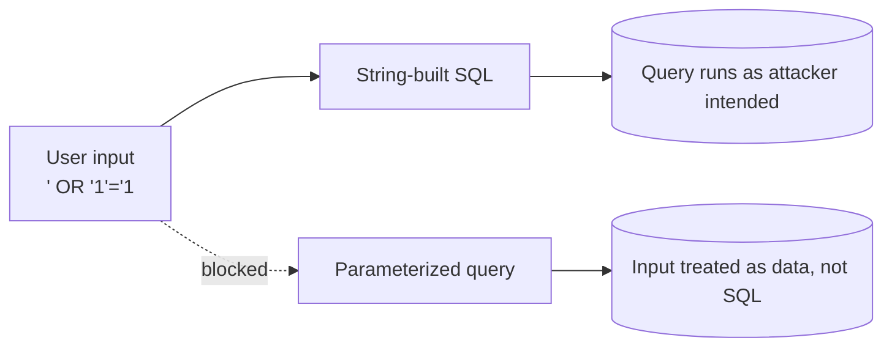
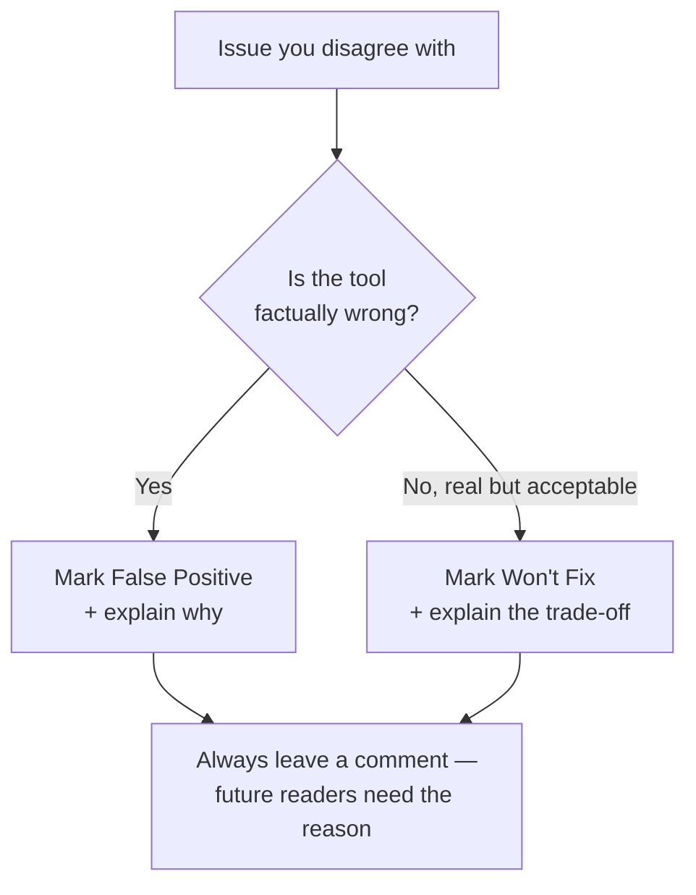
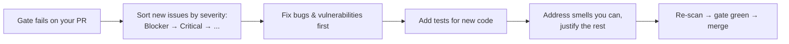

# Fixing Issues and Code Smells

A red dashboard is only useful if you can act on it. This page shows real,
common issues SonarQube raises — with the **before/after** code that clears
them. Each heading notes the rule family so you can search the
[Rules Explorer](https://rules.sonarsource.com/).



## Bug — null pointer dereference

*Rule family: S2259 and friends.* SonarQube traces that a value can be `null` on
some path and is then used without a check.

```java
// ❌ Bug: getUser() can return null; .getEmail() then NPEs
User user = repository.getUser(id);
sendEmail(user.getEmail());
```

```java
// ✅ Guard the nullable value
User user = repository.getUser(id);
if (user == null) {
    throw new UserNotFoundException(id);
}
sendEmail(user.getEmail());
```

## Bug — condition is always true/false

*Rule family: S2583 / S2589.* A check that can never change the outcome usually
hides a logic error.

```js
// ❌ list is created above and never null here — the check is dead,
//    and it hides that we meant to check list.length
const list = getItems();
if (list != null) {        // always true
  process(list);
}
```

```js
// ✅ Express the real intent
const list = getItems();
if (list.length > 0) {
  process(list);
}
```

## Vulnerability — SQL injection

*Rule family: S3649.* Building SQL by string concatenation lets input change the
query.

```python
# ❌ Vulnerability: email is interpolated straight into SQL
cursor.execute(
    "SELECT * FROM users WHERE email = '" + email + "'"
)
```

```python
# ✅ Parameterized query — driver escapes the value
cursor.execute(
    "SELECT * FROM users WHERE email = %s", (email,)
)
```



## Security Hotspot — weak randomness

*Rule family: S2245.* Not always wrong — SonarQube asks you to review.

```java
// ⚠️ Hotspot: fine for a shuffle animation, NOT for a token
String token = Long.toString(new Random().nextLong());
```

```java
// ✅ When it IS security-sensitive, use a CSPRNG
byte[] bytes = new byte[32];
SecureRandom.getInstanceStrong().nextBytes(bytes);
String token = Base64.getUrlEncoder().withoutPadding().encodeToString(bytes);
```

If the original use truly isn't security-sensitive, mark the hotspot **Safe**
with a one-line justification rather than changing the code.

## Code smell — cognitive complexity too high

*Rule family: S3776.* A method with deeply nested branches is hard to follow.
The fix is usually **guard clauses** and **extraction**, not a bigger brain.

```js
// ❌ Smell: deeply nested, high cognitive complexity
function price(order) {
  if (order) {
    if (order.items.length > 0) {
      if (order.customer.isVip) {
        return order.total * 0.8;
      } else {
        return order.total;
      }
    } else {
      return 0;
    }
  }
  return 0;
}
```

```js
// ✅ Flatten with early returns
function price(order) {
  if (!order || order.items.length === 0) return 0;
  return order.customer.isVip ? order.total * 0.8 : order.total;
}
```

## Code smell — duplicated blocks

*Reported as Duplications, also a gate condition.* Extract the shared logic.

```ts
// ❌ Same validation copy-pasted in two handlers
function createUser(b) {
  if (!b.email || !b.email.includes('@')) throw new Error('bad email');
  // ...
}
function updateUser(b) {
  if (!b.email || !b.email.includes('@')) throw new Error('bad email');
  // ...
}
```

```ts
// ✅ One source of truth
function assertValidEmail(email?: string) {
  if (!email || !email.includes('@')) throw new Error('bad email');
}
function createUser(b) { assertValidEmail(b.email); /* ... */ }
function updateUser(b) { assertValidEmail(b.email); /* ... */ }
```

## When SonarQube is wrong: False Positive vs. Won't Fix

Static analysis isn't perfect. You have two honest escape hatches — use the
right one:

| Resolution | Meaning | Use when |
|------------|---------|----------|
| **False Positive** | The tool is mistaken; this is *not* an issue. | The rule misread the code (e.g. a framework guarantees non-null). |
| **Won't Fix** | It's a real issue, but we accept it. | Deliberate trade-off, throwaway script, deprecated module. |



**Don't** suppress issues silently with inline `// NOSONAR` comments as a habit —
they hide the reasoning from the dashboard and from teammates. Resolve them in
the UI with a comment instead, so the decision is auditable.

## A sane fixing workflow



Because the gate only judges **new code** (see
[02-Core-Concepts.md](./02-Core-Concepts.md)), this list is always small and
finite — you're cleaning *what you just wrote*, not the whole repository.
