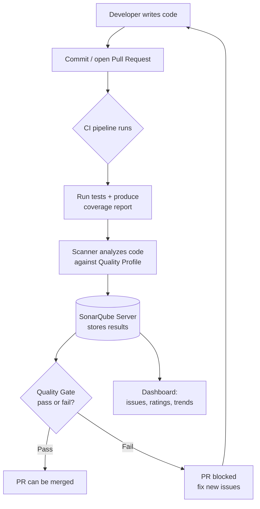

# SonarQube

A practical, example-driven guide to **continuous code-quality inspection** with
SonarQube — not just *what* the dashboard shows, but how to stand a server up,
run your first scan, wire it into CI so a failing **Quality Gate** blocks a merge,
read the issues it reports, and actually fix the bugs, vulnerabilities, and code
smells it finds.

## Contents

| File | What it covers |
|------|----------------|
| [01-SonarQube.md](./01-SonarQube.md) | The fundamentals: what SonarQube is, what it measures, the analysis pipeline, editions. |
| [02-Core-Concepts.md](./02-Core-Concepts.md) | Issues, Quality Gates, Quality Profiles, the rating metrics, and *Clean as You Code*. |
| [03-Running-Your-First-Analysis.md](./03-Running-Your-First-Analysis.md) | Spin up a server with Docker, generate a token, and scan projects (JS, Java, Python, .NET). |
| [04-Quality-Gates-in-Practice.md](./04-Quality-Gates-in-Practice.md) | Designing gate conditions, the default "Sonar way", and worked pass/fail examples. |
| [05-CI-CD-Integration.md](./05-CI-CD-Integration.md) | Real pipeline snippets for GitHub Actions, GitLab CI, Jenkins, and Azure DevOps. |
| [06-Coverage-and-Test-Reports.md](./06-Coverage-and-Test-Reports.md) | Generating and importing coverage from Jest, JaCoCo, coverage.py, and more. |
| [07-Fixing-Issues-and-Code-Smells.md](./07-Fixing-Issues-and-Code-Smells.md) | Before/after fixes for real bugs, vulnerabilities, hotspots, and smells. |

## How code flows through SonarQube

## Reading order

1. Start with **01-SonarQube.md** for the vocabulary and the big picture.
2. Read **02-Core-Concepts.md** to understand issues, gates, profiles, and ratings.
3. Follow **03-Running-Your-First-Analysis.md** to get a real scan on screen.
4. Wire it into your pipeline with **05-CI-CD-Integration.md** and feed it test
   data via **06-Coverage-and-Test-Reports.md**.
5. Tune the gate with **04-Quality-Gates-in-Practice.md**, then use
   **07-Fixing-Issues-and-Code-Smells.md** to clear what it reports.

> Diagrams use [Mermaid](https://mermaid.js.org/), which renders natively on
> GitHub and in most Markdown viewers.

## Further reading

- [SonarQube Documentation](https://docs.sonarsource.com/sonarqube/)
- [Clean as You Code](https://www.sonarsource.com/solutions/clean-as-you-code/)
- [SonarSource Rules Explorer](https://rules.sonarsource.com/)
